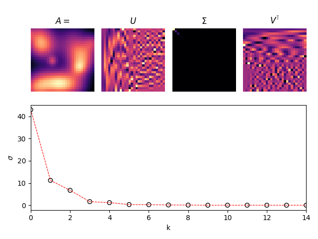
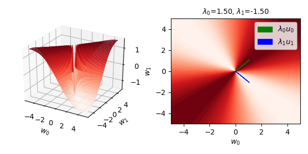

# Computational Linear Algebra

Notes and code experiments for linear algebra in code. The idea is to construct the SVD as soon as possible, then use it for everything else &mdash; from characterizing invertbility, to parametrizing the loss surface of a linear regression model. Some of the interesting stuff that are covered:
  * Proof of the real spectral theorem, and a code demo
  * Proof of the singular value decomposition (SVD)
  * An extensive discussion of the Moore-Penrose pseudoinverse
  * Stability of the Gram-Schmidt algorithm
  * Characterizing the loss surface of a linear regression problem
  * Characterizing quadratic forms using the principal axes theorem.

 

    
     
    <b>Figure.</b> SVD of a sum of Gaussians. Only the first few vectors are meaningful, the rest model noise. 

 

    
     
    <b>Figure.</b> Energy surface of an indefinite matrix. It has a negative minimum and a positive maximum.

 

## Contents

- [Vectors and matrices](#vectors-and-matrices)
- [Singular value decomposition](#singular-value-decomposition)
- [Matrix multiplication and norms](#matrix-multiplication-and-norms)
- [Rank and dimension](#rank-and-dimension)
- [Four fundamental subspaces](#four-fundamental-subspaces)
- [Determinant](#determinant)
- [Matrix inverse and pseudoinverse](#matrix-inverse-and-pseudoinverse)
- [Projection and orthogonalization](#projection-and-orthogonalization)
- [Least squares for model fitting](#least-squares-for-model-fitting)
- [Eigendecomposition](#eigendecomposition)
- [Quadratic form and definiteness](#quadratic-form-and-definiteness)

 

## Quick links

* [Proofs involving the Moore-Penrose pseudoinverse](https://en.wikipedia.org/wiki/Proofs_involving_the_Moore%E2%80%93Penrose_inverse)
* [KaTeX Supported Functions](https://katex.org/docs/supported.html)

 

## References
* [Mike X Cohen.](http://mikexcohen.com/) [*Complete linear algebra: theory and implementation in code*. Udemy. (2021)](https://www.udemy.com/course/linear-algebra-theory-and-implementation/)
* [Sheldon Axler. *Down With Determinants!* The American Monthly. (1996)](https://www.maa.org/sites/default/files/pdf/awards/Axler-Ford-1996.pdf)
* [Leslie Hogben (editor). *Handbook of Linear Algebra*. CRC Press. (2014)](https://www.oreilly.com/library/view/handbook-of-linear/9781466507296/)
* [Cleve Moler. *Numerical Computing with MATLAB*. The MathWorks / SIAM. (2013)](https://www.mathworks.com/moler/index_ncm.html)
* [Peter Olver and Chehzrad Shakiban. *Applied Linear Algebra*. UTM Springer. (2018)](https://www-users.math.umn.edu/~olver/books.html)
* [Petersen & Pedersen. *The Matrix Cookbook*. v. Nov. 15, 2012. (2012)](https://www.math.uwaterloo.ca/~hwolkowi/matrixcookbook.pdf)
