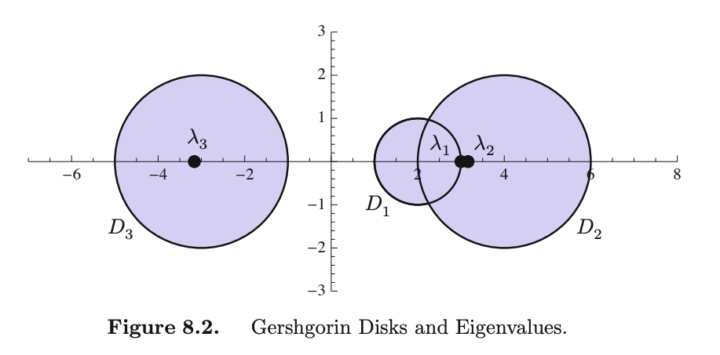

## Eigendecomposition

 

* (10.1) **Eigenvalues and eigenvectors.** Let $\mathbf A$ be a real square matrix which we interpret as an automorphism of the space $\mathbb R^n.$ Eigenvector directions $\mathbf v \neq \mathbf 0$ are directions where the action of $\mathbf A$ is simple: $\mathbf A \mathbf v = \lambda \mathbf v.$ The scalar $\lambda$ is called the eigenvalue. Note that if $\mathbf A$ has a zero eigenvalue, then $\mathbf A$ has a nontrivial null space, i.e. dimension at least one. 

 

- (10.2) **Gershgorin circle theorem.** Let $\mathbf A$ be an $n \times n$ real or complex matrix. For each $1 \leq i \leq n,$ define the $i$th **Gershgorin disk** 
$D_i = \{ z \in \mathbb C \mid | z - a_{ii} | \leq r_i \}$ where $r_i = \sum_{j \neq i} | a_{ij}|.$ 
Thus, the $i$th Gershgorin disk is the subset of 
$\mathbb C$ that is centered on the $i$th diagonal entry of $\mathbf A$ with radius equal to the modulus of the off-diagonal entries of $\mathbf A$ on the $i$th row. The **Gershgorin domain** $D_{\mathbf A} = \bigcup_{i=1}^n D_i \subset \mathbb C$ is simply the union of the Gershgorin disks. The theorem states that all real and complex eigenvalues of $\mathbf A$ lie in its Gershgorin domain $D_{\mathbf A}.$ See [p. 421 of Olver, 2018] for the proof of this theorem. For instance, consider 
  $$
  \mathbf A = 
  \begin{bmatrix}
  2 & -1 & 0 \\
  1 & 4 & -1 \\
  -1 & -1 & -3 \\
  \end{bmatrix}
  $$
  
  The Gershgorin domain of $\mathbf A$ is the plotted below. The eigenvalues of $\mathbf A$ are $3.162, 3.,$ and $-3.162$ all of which lie in $D_{\mathbf A}.$

 

 
[Olver, 2018] p. 421

 

* (10.3) **Diagonalization.** A matrix $\mathbf A \in \mathbb R^n$ is diagonalizable if it has $n$ independent eigenvectors. This means that we can write $\mathbf A\mathbf U = \mathbf U \mathbf \Lambda$ where $\mathbf U = [\mathbf v_1, \ldots, \mathbf v_n]$ and $\mathbf \Lambda = \text{diag}(\lambda_1, \ldots, \lambda_n)$ not necessarily distinct. Since the eigenvectors are linearly independent, they span the whole space so they form a basis for $\mathbb R^n.$ Moreover $\mathbf U$ is invertible so that 
  $$\mathbf A = \mathbf U \mathbf \Lambda \mathbf U^{-1}.$$

  That is, under the basis $\mathbf U$ the matrix $\mathbf A$ acts like a diagonal matrix. Very cool. This is very convenient, e.g. $\mathbf A^k = \mathbf U \mathbf \Lambda^k \mathbf U^{-1}.$ Moreover, this allows the layer perspective $\mathbf A = \sum_{i=1}^n \lambda_i \mathbf u_i\mathbf u_i^\top$ as a sum of rank 1 matrices.

 

* (10.4) **Counterexample: a nondiagonalizable matrix.** The matrix 
    $$\mathbf A = 
    \begin{bmatrix}
        1 & 0 \\ 
        1 & 1 \\
    \end{bmatrix}$$
    has eigenvalues $\lambda_1 = \lambda_2 = 1$ with eigenvectors of the form $\mathbf v = [0, z]^\top$ for nonzero $z \in \mathbb C.$ It follows that $\mathbf A$ is not diagonalizable since it has at most one linearly independent eigenvectors &mdash; not enough to span $\mathbb C^2.$
    
 

* (10.5) **Existence of eigenvalues.** Let $\mathbf A \in \mathbb R^{n \times n}.$ Observe that $\lambda$ is an eigenvalue of $\mathbf A$ iff. it is a zero of the polynomial $p_\mathbf A(\lambda) = \det (\lambda \mathbf I_n - \mathbf A).$ This $n$-degree is called the **characteristic polynomial** of $\mathbf A.$ From the Fundamental Theorem of Algebra, we can write
    $$p_\mathbf A(\lambda) = \prod_{i=1}^s (\lambda - \lambda_i)^{r_i}$$
    
    such that $r_1 + \ldots + r_s = n$ and $\lambda_1, \ldots, \lambda_s \in \mathbb C.$ It follows that $\mathbf A$ has at most $n$ distinct eigenvalues. The number $r_i \in \mathbb N$ is called the **algebraic multiplicity** of $\lambda_i.$ 
    
     

    **Remark.** The eigenvalues and the corresponding eigenvectors of a real matrix can be complex valued. In the example below, the matrix $\mathbf B$ is diagonalizable in $\mathbb C$ but not in $\mathbb R.$ This can be tested in numpy.

 

* (10.6) **Eigenspaces.** Given any eigenvalue $\lambda,$ we can solve for all corresponding eigenvectors by finding $\mathbf v$ such that $(\lambda \mathbf I_n - \mathbf A)\mathbf v = \mathbf 0,$ e.g. by Gaussian elimination. The eigenvectors of $\lambda$ form a subspace 
  $$E_\lambda = \mathsf{N}(\lambda \mathbf I_n - \mathbf A)$$ 
  
  called the **eigenspace** of $\lambda.$ In a diagonalization of $\mathbf A$ with respect to an eigenbasis, the eigenspace $E_\lambda$ corresponds to a block $\lambda \mathbf I_{k}$ where $k= \dim E_\lambda$ is called the **geometric multiplicity** of $\lambda.$ It turns out that the geometric multiplicity of $\lambda$ is bounded above by its algebraic multiplicity. This applies to all matrices $\mathbf A,$ i.e. not just for diagonalizable ones.
  
   

  **Proof.** (Geometric mult. $\leq$ algebraic mult.) Let $\lambda_1$ be an eigenvalue of $\mathbf A.$ To see why the inequality should be true, consider a basis for $E_{\lambda_1}$ consisting of $k$ vectors, we can extend this to a basis for $\mathbb R^n$ which we collect in the columns of a matrix $\mathbf V.$ Then 
    $$\mathbf A = \mathbf V \begin{bmatrix}
        {\lambda_1} \mathbf I_k & \mathbf C \\ 
        \mathbf 0 & \mathbf D \\
    \end{bmatrix} \mathbf V^{-1}$$ 

    for some matrices $\mathbf C$ and $\mathbf D$ which can have arbitrary structure. Thus, with the determinants of $\mathbf V$ and its inverse $\mathbf V^{-1}$ cancelling out, we get
    $$
    \begin{aligned}
    p_\mathbf A(\lambda) 
    = \det (\lambda \mathbf I - \mathbf A)
    = (\lambda - {\lambda_1})^k\det(\lambda \mathbf I_{n-k} - \mathbf D).
    \end{aligned}
    $$

    Since the latter determinant can have a factor of $(\lambda - {\lambda_1}),$ this implies that the algebraic multiplicity of ${\lambda_1}$ is at least $k$ proving the result. $\square$

     

    **Remark.** In a diagonalizable matrix, we get equality between algebraic and geometric multiplicities obtaining an eigenbasis for $\mathbb R^n$ since eigenvectors belonging to different eigenspaces are linearly independent.  

 

* (10.7) **Eigenspace as invariant subspace.** Note that eigenspaces are necessarily invariant subspaces of $\mathbf A.$ This automatically sets restrictions on the geometry. Consider
  $$\mathbf B = 
  \begin{bmatrix}
     0 & 1 &  0 \\ 
    -1 & 0 &  0 \\
     0 & 0 & -5
  \end{bmatrix}$$
    which is a rotation matrix with $\theta = \frac{\pi}{2}$ on the $xy$-plane and a stretching on the $z$ plane. From the geometry, we can already see that there cannot exist a real eigendecomposition of $\mathbf B$ since the $xy$-plane which is a 2-dimensional invariant subspace undergoes a rotation.

  

* (10.8) **Eigenvalues of triangular matrices.** The eigenvalues of triangular matrices can be read off from its diagonal. This follows from the fact that the only nonzero term in the determinant expansion of the characteristic polynomial is that which follows the path along the diagonal. For an upper triangular matrix, you have to start with $a_{11}-\lambda.$ Thus, the next factor can only be chosen from $a_{22} -\lambda$ and $a_{j2} = 0$ for $j > 2.$ This forces $j = 2,$ and we have $(a_{11} -\lambda)(a_{22}-\lambda)$ so far. And so on, getting all diagonal entries.

 

* (10.9) **Trace and determinant formula.** We prove two formulas: 
  * $\det \mathbf A=\prod_{i=1}^n \lambda_i$

  * $\text{tr} \mathbf A = \sum_{i=1}^n \lambda_i$
  
   

  **Proof.** (1) To prove the first, set $\lambda = 0$ in the characteristic polynomial, we get
    $$p_\mathbf A(0) = \det (0\mathbf I - \mathbf A) = \det(-\mathbf A) = \prod_{i=1}^n (-\lambda_i) = (-1)^n\prod_{i=1}^n \lambda_i.
    $$

    Incidentally, this is $c_0$ coefficient of the characteristic polynomial. Note that $\det(-\mathbf A) = (-1)^n\det(\mathbf A).$ Thus, $\det \mathbf A=\prod_{i=1}^n \lambda_i.$ 
    
     

    (2) Consider the coefficient $c_{n-1}$ of the characteristic polynomial. These are the terms in the determinant function that takes $n-1$ of the diagonal entries, and one that is off diagonal. However, this forces us to multiply *all* diagonal entries. Thus, $c_{n-1}$ is the coefficient of $\lambda^{n-1}$ in $\det(\lambda \mathbf I_n - \mathbf A).$ Note that expansion when multiplying out binary terms is akin to a binary tree expansion. The terms we're iterested in chooses $n-1$ of $\lambda$ and one of the other factor. These occur in $n$ leaves, i.e. $-a_{11} \lambda^{n-1}, \ldots, -a_{nn} \lambda^{n-1}.$ Thus, $c_{n-1} = -\lambda^{n-1}\text{tr} \mathbf A.$ On the other hand, solving for $c_{n-1}$ in the expansion of $p_\mathbf A(\lambda) = \prod_{i=1}^n(\lambda - \lambda_i)$ we get $c_{n-1} = -\lambda^{n-1}\sum_{i=1}^{n} \lambda_i.$ Thus, $\text{tr}\mathbf A = \sum_{i=1}^n \lambda_i.$ $\square$

 

* (10.10) **Eigenvalues occur in conjugate pairs.** Complex eigenvalues of a real (!) matrix come in conjugate pairs. This is obtained by taking the conjugate of both sides of the eigenvalue equation. This explains why $\det \mathbf A = \prod_{i=1}^n \lambda_i$ is real even if the eigenvalues can be complex.

 

- (10.11) **Growth of iterated maps**. Let $\lambda$  be the principal eigenvalue of $\mathbf A$, then

    $$\dfrac{\lVert \mathbf A^k \mathbf v\rVert}{\lVert \mathbf A^{k-1} \mathbf v\rVert} \approx |\lambda| .$$

    That is the vector $\mathbf A^k\mathbf v$ gets squashed into a principal eigenvector direction. If there are more than one, then it's like being stuck at a local minima, e.g. oscillation. If $|\lambda| > 1$, then $\lVert \mathbf A^k \mathbf v \rVert$ explodes. To  prevent this, we can scale $\mathbf A \leftarrow |\lambda|^{-1}\mathbf A$. So that 

    $$\dfrac{|{\lambda}|^{k-1}}{|\lambda|^{k}}\dfrac{\lVert \mathbf A^k \mathbf v\rVert}{\lVert \mathbf A^{k-1} \mathbf v\rVert} =  \dfrac{1}{|\lambda|}\dfrac{\lVert \mathbf A^k \mathbf v\rVert}{\lVert \mathbf A^{k-1} \mathbf v\rVert} \approx 1.$$

    as $k \to \infty$ (right) so the norm stabilizes to some fixed value (left). This is simulated in `18_iterated_maps.py`. Observe some oscillation because two of the eigenvalues of $\mathbf A$ are $3$ and ~$3.16$ are close to each other, i.e. $\frac{|\lambda_1|}{|\lambda_2|} \to 0$ at a slower rate. See equations (9) and (10) in this [blog post on power iteration](https://andrewcharlesjones.github.io/posts/2021/01/power-iteration/) which gives a proof of this behavior of iterated maps. It is assumed that $\mathbf A$ is diagonalizable. 
    
     

    

    
    

 