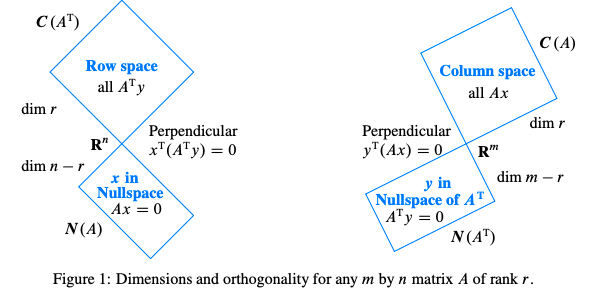
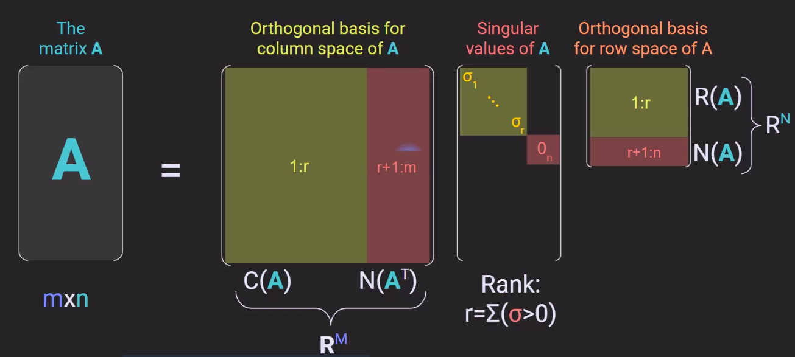

## Four fundamental subspaces

 

* (5.1) **Four Fundamental Subspaces.** The so-called four fundamental subspaces of matrix $\bold A \in \mathbb R^{m \times n}$ are subspaces form an orthogonal direct sum decomposition of its input space $\mathbb R^n$ and its output spaces $\mathbb R^m.$ Namely:

  * $\mathsf{C}(\bold A^\top) \oplus \mathsf{N}(\bold A) =\, \mathbb R^n \;\; \text{s.t.} \;\; \mathsf{C}(\bold A^\top) \perp \mathsf{N}(\bold A)$

  * $\mathsf{C}(\bold A) \oplus \mathsf{N}(\bold A^\top) =\, \mathbb R^m \;\; \text{s.t.} \;\; \mathsf{C}(\bold A) \perp \mathsf{N}(\bold A^\top)$ 
  
   

  **Proof.** Suppose $\bold x \in \mathbb R^m$ and consider the SVD $\bold A = \bold U \bold \Sigma \bold V^\top.$ Let $\tilde \bold x = \bold x - \bold U \bold U^\top \bold x.$ Note that $\bold U\bold U^\top \bold x \in \mathsf{C}(\bold A)$ since the columns of $\bold U$ are $\bold u_i = \bold A \bold v_i$ for $i = 1, \ldots, r$ where $r = \text{rank }\bold A,$ and the singular vectors $\bold u_i$ and $\bold v_j$ are, resp., ONBs of $\mathbb R^m$ and $\mathbb R^n.$ Then

  $$
  \bold A^\top \tilde \bold x = {\bold V} {\bold \Sigma} {\bold U}^\top \left( \bold x - \bold U \bold U^\top \bold x \right) = \bold 0.
  $$

  It follows that $\mathbb R^m = \mathsf{N}(\bold A^\top) + \mathsf{C}(\bold A).$ To complete the proof, we show the intersection is zero. Suppose $\bold y \in  {\mathsf{N}(\bold A^\top)} \cap {\mathsf{C}(\bold A)}.$ Then, $\bold A^\top\bold y = \bold 0$ and $\bold y = \bold A \bold x$ for some $\bold x \in \mathbb R^n.$ Thus, $\bold A^\top \bold A \bold x = \bold 0$ which implies $\bold A \bold x = \bold 0.$ In other words, $\bold y = \bold 0.$ This proves the direct sum decomposition. To prove orthogonality, observe that $\bold A \bold x = \bold 0$ implies $\bold x \perp \mathsf{C}(\bold A^\top)$ since it is orthogonal to each vector that spans it. The other follows  by duality. $\square$ 
  
   

    

    
    

 

* (5.2) **Basis for fundamental subspaces.** 
  Basis for the fundamental subspaces can be obtained from the SVD. We can write $\bold A^\top = \bold V\bold \Sigma \bold U^\top$ so that $\bold A^\top \bold u_i = \sigma_i \bold v_i$ or for $i = 1, \ldots, r = \text{rank }\bold A.$ Thus, $\bold v_1, \ldots, \bold v_r$ forms a basis for $\mathsf{C}(\bold A).$ Moreover, $\bold v_{r+1}, \ldots, \bold v_{n}$ are $n - r$ vectors in $\mathsf{N}(\bold A),$ hence a basis by counting. Applying the same argument for the output space, we get the ff. table: 

  

  Subspace | Basis | Subspace | Basis
  ------ | ------ | ------ | ------
  $\mathsf{C}(\bold A^\top)$ | $\bold v_1, \ldots, \bold v_r$ | $\mathsf{C}(\bold A)$ | $\bold u_1, \ldots, \bold u_r$
  $\mathsf{N}(\bold A)$ | $\bold v_{r+1}, \ldots, \bold v_n$ | $\mathsf{N}(\bold A^\top)$ | $\bold u_{r+1}, \ldots, \bold u_n$ 

  

   
    
  **Remark.** Observe that from these bases, we obtain $\mathbb R^n = \mathsf{C}(\bold A^\top) \oplus \mathsf{N}(\bold A)$ the orthogonality of these subspaces for free! 

 

      
    <b>Figure.</b> Visualizing the above table. Here R(A) on the right denotes the row space. 

 

* (5.3) **Solutions to linear equations.** Consider the linear system $\bold A \bold x = \bold y.$ Then, because $\mathbb R^n = \mathsf{C}(\bold A^\top) \oplus \mathsf{N}(\bold A)$, the solution set for this system is given by
  $$\bold x = \bold h + \sum_{k=1}^r c_k\bold v_k$$

  where $\bold h \in \mathsf{N}(\bold A)$ and $c_1, \ldots, c_r \in \mathbb R.$ The parameters $c_k$ are sometimes called free variables and $\bold h$ a solution to the homogeneous system $\bold A \bold x = \bold 0.$ 

 

* (5.4) **Understanding the direct sum decomposition.** 
  Geometrically, the whole subspace $\mathsf{N}(\bold A)$ gets collapsed to the zero of the output space, while the orthogonal subspace, which turns out to be $\mathsf{C}(\bold A^\top)$, gets mapped to $\mathsf{C}(\bold A).$ Come to think of it, it's not surprising that the row space is spanned by the left singular vectors $\bold v_k$ for $k = 1, \ldots, r$ that is orthogonal to the null space. Consider the operation $\bold y^\top \bold A$ which is a linear combination of the row vectors. This turns out to be $\bold y^\top \bold U \bold \Sigma \bold V^\top$ which is a linear combination of the first $r$ row vectors of $\bold V.$

 