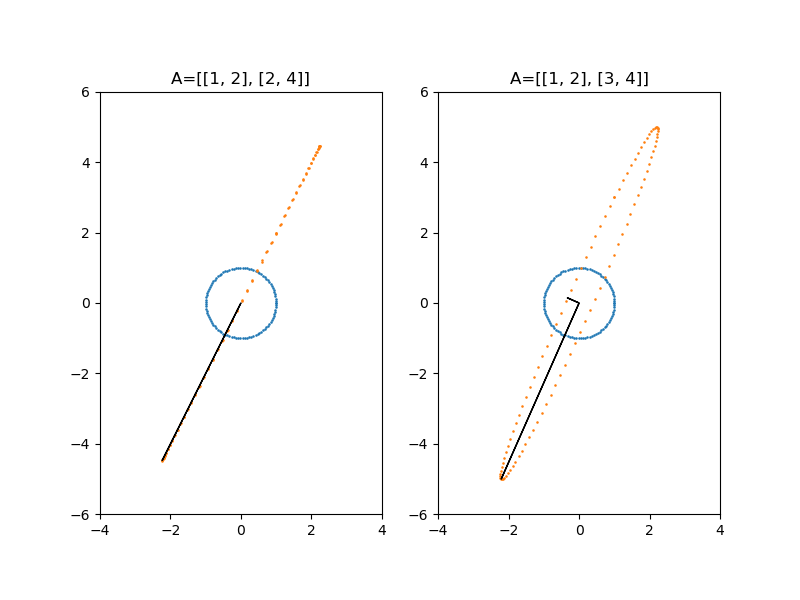

# Notes
  - (2.30) **No. of linearly independent vectors in ${\mathbb R^m}$**.  The maximum length $n$ of a list of linearly independent vectors in $\mathbb R^m$ is bounded by $m$.  If $n > m$, then the list is linearly dependent. <br><br>
  
  - (2.30) **Complexity of checking independence**.
  Suppose $n \leq m.$ What is the time complexity of showing n vectors in $\mathbb R^m$ are linearly independent? i.e. solving for nonzero solutions to $\bold A\bold x = \bold 0$. For instance, we have $\mathcal{O}(\frac{2}{3} mn^2)$ using Gaussian elimination assuming $\mathcal{O}(1)$ arithmetic which is a naive assumption as careless implementation can easily create numbers with with [exponentially many bits](https://cstheory.stackexchange.com/questions/3921/what-is-the-actual-time-complexity-of-gaussian-elimination)! In practice, the best way to compute the rank of $\bold A$ is through its SVD. This is, for example, how `numpy.linalg.matrix_rank` is implemented.
  <br><br>

  - (2.30) **Basis are non-unique**.
  Non-unique, but gives unique coordinate for each vector when the choice of basis is fixed. Some basis are better than others for a particular task, e.g. describing a dataset better. There are algorithms such as PCA & ICA that try to minimize some objective function.<br><br>

  - (3.34) **Shifting a matrix away from degeneracy**:
  $\bold A + \lambda \bold I = \bold C.$ 
  Geometric interpretation: inflate a matrix from a degenerate plane towards being a sphere. This is a form of regularization.  See (4.51) which shows how linear maps transform the unit circle to an ellipse. A singular matrix $\bold A$ maps the unit circle to a degenerate (flat) ellipse.
  <br><br>

  - (3.35) In the video $\sigma \bold A = \bold A \sigma$. Multiplying a matrix with a scalar $\sigma$ can be interpreted as multiplying with $\sigma \bold I$ where $\bold I$ is the identity matrix of the appropriate size. <br><br>

  - (3.37) **Calculating the Hermitian transpose in Python.** Let `A` be a numpy array. The following calculates the Hermitian transpose:
    1. `np.conj(A).T`
    2. `np.conj(A.T)`
    3. `np.matrix(A).H` (deprecated soon)<br><br>

* (4.44) Cool way of writing the four ways of matrix multiplication: 

  - **Outer product perspective** <br> 
    ```
    AB[i, j] = sum(k, A[i, k] B[k, j]) 
             = sum(k, outer(A[:, k], B[k, :])[i, j]
    ```
  - **Row perspective**: <br> 
    ```
    AB[i, :] = sum(k, A[i, k] B[k, :]) 
    ```
  - **Column perspective**: <br> 
    ```
    AB[:, j] = sum(k, A[:, k] B[k, j]) 
    ```
  <br>

* (4.46) **Eigendecomposition of a matrix**
  $\bold A \bold U = \bold U \bold \Lambda$.
  The eigendecomposition of a matrix is an example of the fact that post-multipyling with a diagonal matrix weights the column &mdash; in this case, the matrix $\bold U$ of eigenvectors of $\bold A$ with the eigenvalues in the diagonal of $\bold \Lambda$.
  <br><br>


* (4.51) **Geometry of linear transformations.** In the code challenge, we saw that a unit circle is mapped into an ellipse. An explanation for this begins by considering the polar decomposition of any real matrix $\bold A$ (exists! &mdash; unique?) into $\bold A =  \bold U \bold P$ where $\bold U \in \mathbb{R}^{n\times n}$ is orthogonal and $\bold P \in \mathbb{R}^{n\times n}$ is symmetric positive semidefinite. The name "polar decomposition" comes from writing complex numbers as $z = re^{i\theta}$ in terms of its polar coordinates. Here $r = \sqrt{\bar z z }$ (analogous to $\sqrt{\bold A^* \bold A}$; see remark below) and multiplication by $e^{i\theta}$ is an isometry of $\mathbb C$ (analogous to the isometric property of $\bold U$). Symmetric matrices in $\mathbb R^{n \times n}$ are self-adjoint operators on $\mathbb R^n$, so $\bold P$ has real eigenvalues [[Prop. 7.6]](https://www.maa.org/sites/default/files/pdf/awards/Axler-Ford-1996.pdf). These eigenvalues are nonnegative since $\bold P$ is semidefinite. Self-adjointness on $\mathbb R^n$ further implies that $\bold P$ has $n$ real eigenvalues and $n$ real orthonormal eigenvectors [[Thm. 8.3]](https://www.maa.org/sites/default/files/pdf/awards/Axler-Ford-1996.pdf). This is called the **real spectral theorem** which allows us to write $\bold P = \bold Q \bold \Lambda \bold Q^\top$ where $\bold Q$ is the orthogonal matrix formed by column stacking the eigenvectors of $\bold P$. If we look at $\bold Q$ and $\bold Q^\top$ as change of basis matrices, or writing $\bold P \bold x = \sum_{i=1}^n \lambda_i \bold q_i \bold q_i^\top \bold x$ (projection operators!) we see that $\bold A$ stretches $\mathbb R^n$ in the direction of the $n$ orthogonal eigenvectors, followed by an orthogonal transformation by $\bold U$. We can [calculate](https://math.stackexchange.com/a/2924263) that orthogonal transformations of $\mathbb R^2$ are either rotations or reflections. Thus, the unit circle in $\mathbb R^2$ is stretched onto an ellipse that is either reflected or rotated resulting to the final ellipse! Note that the rank of $\bold A$ is equal to the rank of $\bold P$ since $\bold U$ is nonsingular. So, whenever $\bold A$ doesn't have full rank, some eigenvalues of $\bold P$ are zero, which results to a degenerate ellipse, i.e. an ellipse collapsing on some axis (see below).
<br><br>
**Remark.** The polar decomposition comes from the SVD which states that any real matrix $\bold A \in \mathbb R^{m \times n}$ can be written as $\bold A = \bold U \bold \Sigma \bold V^\top$ where $\bold U \in \mathbb R^{m \times m}$ and $\bold V \in \mathbb R^{n \times n}$ are real orthonogonal matrices and $\bold\Sigma  \in \mathbb R^{m \times n}$ is a diagonal matrix with nonnegative real numbers on the diagonal are the singular values of $\bold A$. The number of nonzero singular values is equal to the rank of $\bold A$. Observe that writing $\bold A = (\bold U \bold V^\top ) ( \bold V\bold \Sigma \bold V^\top )$ gives us the polar decomposition. <br><br>

* (4.51) **Computing the polar decomposition.** In `src\4_polar_decomp.py`, we verify the theory by calculating the polar decomposition: `U, P = scipy.linalg.polar(A)`. The result is that `P` is real symmetric and `U` is real orthogonal. Some eigenvalues of `P` are zero for singular `A`  (right) while all are nonzero for nonsingular `A` (left). The eigenvectors of `P` are scaled by the corresponding eigenvalues, then rotated with `U`. The rotated eigenvectors of `P` lie along the major and minor axis of the ellipse: the directions where the circle is stretched prior to rotation. This checks out! The code also shows getting the polar decomposition from the SVD. <br><br>
    <p align="center">
    
    </p> <br>
    
    **Remarks.**
    This gives us the intuition that $\bold P$ in the polar decomposition must be unique. Indeed, $\bold P^2 = \bold A^\top \bold A$. Since $\bold A^\top \bold A$ is evidently symmetric  positive semidefinite, it has a unique symmetric positive semidefinite square root $\sqrt{\bold A^\top \bold A}$ [[Thm. 3]](https://www.math.drexel.edu/~foucart/TeachingFiles/F12/M504Lect7.pdf). Then, $\bold P = \sqrt{\bold A ^\top \bold A}$ by uniqueness. It follows that the polar decomposition can be written as $\bold A = \bold U \sqrt{\bold A^\top \bold A}$ for some orthogonal matrix $\bold U$ &mdash; cf. [[Lem. 9.6]](https://www.maa.org/sites/default/files/pdf/awards/Axler-Ford-1996.pdf) which states the polar decomposition in terms of the existence such an isometry.
    The matrix $\bold U$ is only unique if $\bold A$ is nonsingular. For instance, if $\bold A$ is singular, then we can reflect across the axis where the space is collapsed and still get the same transformation.<br><br> 

* **Orthogonal matrices in $\mathbb R^n$ are precisely the linear isometries of $\mathbb R^n$.** A matrix $\bold A \in \mathbb R^n$ is an isometry if $\lVert \bold A \bold x\rVert^2 = \lVert \bold x \rVert^2$ for all $\bold x \in \mathbb R^n$. Note that $\lVert \bold A \bold x \rVert^2 = \bold x^\top\bold A^\top \bold A \bold x$ and $\lVert \bold x \rVert^2 = \bold x^\top \bold x$. So orthogonal matrices are isometries. Conversely, if a matrix $\bold A$ is an isometry, we can let $\bold x = \bold e_i - \bold e_j$ to get $\bold e_i^\top (\bold A^\top \bold A) \bold e_j = 
(\bold A^\top \bold A)_{ij} 
= \delta_{ij}$ where $\delta_{ij}$ is the Kronecker delta or $\bold A^\top\bold A = \bold I$. This tells us that length preserving matrices in $\mathbb R^n$ are necessarily orthogonal. Orthogonal matrices in $\mathbb R^2$ are either rotations or reflections &mdash; both of these are length preserving. The more surprising result is that these are the only length preserving matrices in $\mathbb R^2$!
<br><br> 

* **A nondiagonalizable matrix.** The matrix $\bold A = [[1, 0], [1, 1]]$ has eigenvalues are $\lambda_1 = \lambda_2 = 1$ with eigenvectors of the form $\bold v = [0, t]^\top$ for nonzero $t \in \mathbb R$. It follows that $\bold A$ is not diagonalizable since it has at most one linearly independent eigenvectors &mdash; not enough to span $\mathbb R^2$.


<!--- Template
* (4.46) **Punchline.**
  body.
  <br><br> 

* (4.46) **Test image.**<br>
  
  <br><br>
--->