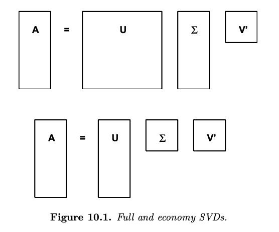
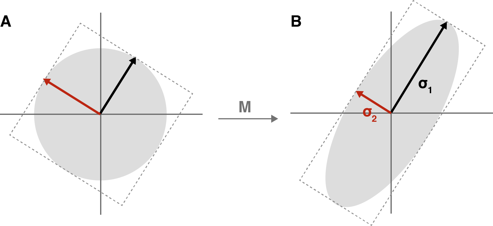
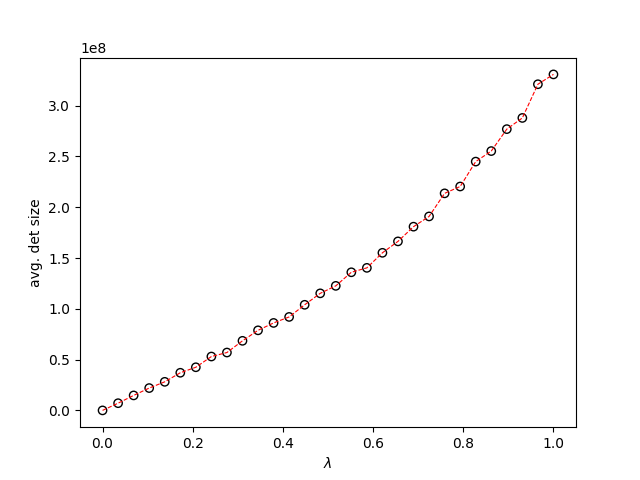
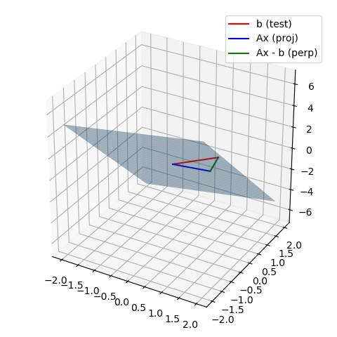
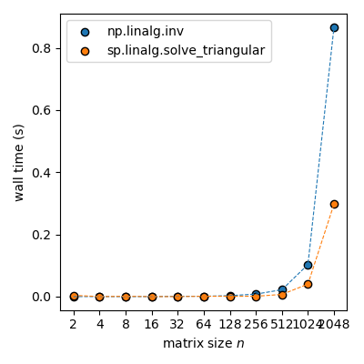
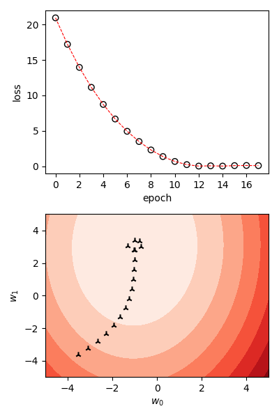
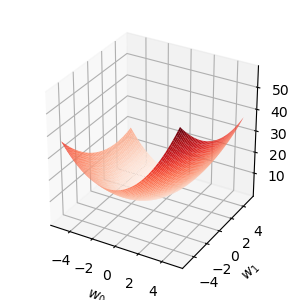
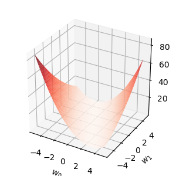

# Notes

- [Notes](#notes)
  - [Vectors and matrices](#vectors-and-matrices)
  - [Geometry of linear operators](#geometry-of-linear-operators)
  - [Matrix multiplication and norms](#matrix-multiplication-and-norms)
  - [Rank and dimension](#rank-and-dimension)
  - [Four fundamental subspaces](#four-fundamental-subspaces)
  - [Determinant](#determinant)
  - [Matrix inverse](#matrix-inverse)
  - [Projection and orthogonalization](#projection-and-orthogonalization)
  - [Least squares for model fitting](#least-squares-for-model-fitting)
  - [Eigendecomposition](#eigendecomposition)
  - [Singular value decomposition](#singular-value-decomposition)
  - [Quadratic form and definiteness](#quadratic-form-and-definiteness)

<br>

## Vectors and matrices

---

[Back to top](#notes)

  - (2.30) **No. of linearly independent vectors in ${\mathbb R^m}$**.  The maximum length $n$ of a list of linearly independent vectors in $\mathbb R^m$ is bounded by $m$.  If $n > m$, then the list is linearly dependent. 
  
<br>
  
  - (2.30) **Complexity of checking independence**.
  Suppose $n \leq m.$ What is the time complexity of showing n vectors in $\mathbb R^m$ are linearly independent? i.e. solving for nonzero solutions to $\bold A\bold x = \bold 0$. For instance, we have $\mathcal{O}(\frac{2}{3} mn^2)$ using Gaussian elimination assuming $\mathcal{O}(1)$ arithmetic which is a naive assumption as careless implementation can easily create numbers with with [exponentially many bits](https://cstheory.stackexchange.com/questions/3921/what-is-the-actual-time-complexity-of-gaussian-elimination)! In practice, the best way to compute the rank of $\bold A$ is through its SVD. This is, for example, how `numpy.linalg.matrix_rank` is implemented.

<br>

  - (2.30) **Basis is non-unique.**
  A choice of basis is non-unique but gives unique coordinates for each vector once the choice of basis is fixed. Some basis are better than others for a particular task, e.g. describing a dataset better. There are algorithms such as PCA & ICA that try to minimize some objective function.
  
<br>

  * **Orthogonal matrices are precisely the linear isometries of $\mathbb R^n$.** A matrix $\bold A \in \mathbb R^n$ is an isometry if $\lVert \bold A \bold x\rVert^2 = \lVert \bold x \rVert^2$ for all $\bold x \in \mathbb R^n$. Note that $\lVert \bold A \bold x \rVert^2 = \bold x^\top\bold A^\top \bold A \bold x$ and $\lVert \bold x \rVert^2 = \bold x^\top \bold x$. So orthogonal matrices are isometries. Conversely, if a matrix $\bold A$ is an isometry, we can let $\bold x = \bold e_i - \bold e_j$ to get $\bold e_i^\top (\bold A^\top \bold A) \bold e_j = 
  (\bold A^\top \bold A)_{ij} 
  = \delta_{ij}$ where $\delta_{ij}$ is the Kronecker delta or $\bold A^\top\bold A = \bold I$. This tells us that length preserving matrices in $\mathbb R^n$ are necessarily orthogonal. Orthogonal matrices in $\mathbb R^2$ are either rotations or reflections &mdash; both of these are length preserving. The more surprising result is that these are the only length preserving matrices in $\mathbb R^2$!

<br>

  - **Orthogonal matrices as projections.** An orthogonal matrix $\bold U$ is defined as a matrix with orthonormal vectors in its column. It follows $\bold U^\top \bold U = \bold I.$ Since $\bold U$ is invertible, we can use uniqueness of inverse to get $\bold U \bold U^\top = \bold I.$ However, we can obtain this latter identity geometrically. Let $\bold x$ be a vector, then $\bold x = \sum_i \bold u_i \bold u_i^\top \bold x.$ This is true by uniqueness of components in a basis. Thus, $\bold U \bold U^\top \bold x = \bold x$ for any $\bold x,$ or $\bold U \bold U^\top  = \bold I.$ 
  
<br>

  - (3.34) **Shifting a matrix away from degeneracy:**
  $\bold A + \lambda \bold I = \tilde\bold A.$ 
  Geometric interpretation: inflate a matrix from a degenerate plane towards being a sphere. This is a form of regularization.  See (4.51) which shows how linear maps transform the unit circle to an ellipse. A singular matrix $\bold A$ maps the unit circle to a degenerate (flat) ellipse.
  <br><br>

  - (3.35) In the video $\sigma \bold A = \bold A \sigma$. Multiplying a matrix with a scalar $\sigma$ can be interpreted as multiplying with $\sigma \bold I$ where $\bold I$ is the identity matrix of the appropriate size. <br><br>

  - (3.37) **Calculating the Hermitian transpose in Python.** Let `A` be a numpy array. The following calculates the Hermitian transpose:
    1. `np.conj(A).T`
    2. `np.conj(A.T)`
    3. `np.matrix(A).H` (deprecated soon)<br><br>

* (4.44) Cool way of writing the four ways of matrix multiplication: 

  - **Outer product perspective** <br> 
    ```
    AB[i, j] = sum(k, A[i, k] B[k, j]) 
             = sum(k, outer(A[:, k], B[k, :])[i, j]
    ```
  - **Row perspective**: <br> 
    ```
    AB[i, :] = sum(k, A[i, k] B[k, :]) 
    ```
  - **Column perspective**: <br> 
    ```
    AB[:, j] = sum(k, A[:, k] B[k, j]) 
    ```
  <br>

## Geometry of linear operators

---

[Back to top](#notes)

* (4.51) **Geometry of linear operators.** In the code challenge, we saw that a unit circle is mapped by a square matrix $\bold A$ into an ellipse. It turns out that the effect of a square matrix $\bold A \in \mathbb R^{2 \times 2}$ as an operator on $\mathbb R^2$ is to dilate the space outwards in two orthogonal directions (possibly some directions shrinking to zero, but never in a negative direction), then resulting space is rotated twice. To see this, let $\bold A = \bold U \bold \Sigma \bold V^\top$ be the SVD of $\bold A$, then $\bold A = (\bold U \bold V^\top) (\bold V \bold\Sigma \bold V^\top)$. The factor $\bold V \bold\Sigma \bold V^\top$ dilates the space two orthogonal directions defined by the columns of $\bold V$ while the strength of the dilation is determined by the singular values in the diagonal of $\bold \Sigma$. 
We can interpret $\bold V$ and $\bold V^\top$ as change of basis matrices, i.e. in terms of a sum of projection operators $\sum_{i=1}^n \sigma_i \bold v_i \bold v_i^\top$. This is followed by a product $\bold U \bold V^\top$ of two isometries of $\mathbb R^2$. It can be [easily calculated](https://math.stackexchange.com/a/2924263) that orthogonal transformations of $\mathbb R^2$ are either rotations or reflections, so that we get a final ellipse. Since the rank of $\bold A$ is equal to the number of nonzero singular values, whenever $\bold A$ is singular, some of its singular values will be zero corresponding to an axis where the ellipse collapses (see figure below). 

<br>

* (4.51) **Polar decomposition.** The decomposition of an operator $\bold A \in \mathbb R^{n\times n}$ in (4.51) into $\bold A = \bold Q \bold P$ where $\bold Q$ is orthogonal and $\bold P$ is symmetric positive semidefinite is called the **polar decomposition**. Geometrically, we can see that $\bold P$ should be unique. Indeed, observe that $\bold P^2 = \bold A^\top \bold A$ and $\bold A^\top \bold A$ is evidently symmetric positive semidefinite, so it has a unique symmetric positive semidefinite square root $\sqrt{\bold A^\top \bold A}$ [[Thm. 3]](https://www.math.drexel.edu/~foucart/TeachingFiles/F12/M504Lect7.pdf). Thus, $\bold P = \bold V \bold \Sigma \bold V^\top = \sqrt{\bold A ^\top \bold A}$ by uniqueness. Note however that the eigenvectors the orthogonal eigendecomposition into need not be unique (e.g. when the kernel of $\bold A$ is nonzero). For real matrices, the isometries are precisely the orthogonal matrices. Thus, the polar decomposition can be written as $\bold A = \bold Q \sqrt{\bold A^\top \bold A}$ for some isometry $\bold Q$; cf. [[Lem. 9.6]](https://www.maa.org/sites/default/files/pdf/awards/Axler-Ford-1996.pdf) which states the polar decomposition in terms of the existence of such an isometry. The matrix $\bold Q$ is only unique if $\bold A$ is nonsingular. For instance, if $\bold A$ is singular, then we can reflect across the axis where the space is collapsed and still get the same transformation. <br>
   
    **Remark.** The name "polar decomposition" comes from the analogous decomposition of complex numbers as $z = re^{i\theta}$ in polar coordinates. Here $r = \sqrt{\bar z z }$ (analogous to $\sqrt{\bold A^* \bold A}$) and multiplication by $e^{i\theta}$ is an isometry of $\mathbb C$ (analogous to the isometric property of $\bold Q$). For complex matrices we consider $\bold A^*\bold A$ and unitary matrices in the SVD.
    
<br>

* (4.51) **Computing the polar decomposition.** In `src\4_polar_decomp.py`, we verify the theory by calculating the polar decomposition from `u, s, vT = np.linalg.svd(A)`. We set `Q = u @ vT` and `P = vT.T @ np.diag(s) @ vT`. Some singular values are zero for singular `A`  (left) while all are nonzero for nonsingular `A` (right). The eigenvectors of `P` are scaled by the corresponding eigenvalues, then rotated with `Q`. The rotated eigenvectors of `P` lie along the major and minor axis of the ellipse: the directions where the circle is stretched prior to rotation. The code checks out in that the eigenvectors (obtained from SVD) line up nicely along the axes where the circle is elongated in the scatter plot (obtained by plotting the output vectors `A @ [x, y]` where `[x, y]` is a point on the unit circle).

    <br>

    <p align="center">
    
    </p> 
    
<br>

* **SVD Proof.** The SVD states that any real matrix $\bold A \in \mathbb R^{m \times n}$ can be decomposed as $\bold A = \bold U \bold \Sigma \bold V^\top$ where $\bold U \in \mathbb R^{m \times m}$ and $\bold V \in \mathbb R^{n \times n}$ are orthonogonal matrices and $\bold\Sigma  \in \mathbb R^{m \times n}$ is a diagonal matrix with nonnegative real numbers on the diagonal. The diagonal entries $\sigma_i$ of $\bold \Sigma$ are called the **singular values** of $\bold A$. The number $r$ of nonzero singular values is equal to the rank of $\bold A$ as we will show shortly. 
<br><br>
The following proof of the SVD is constructive, i.e. we construct the singular values, and left and right singular vectors of $\bold A.$
Let $r = \text{rank }\bold A$, then $r \leq \min(m, n)$. 
Observe that $\bold A^\top \bold A \in \mathbb R^{n\times n}$ is symmetric positive semidefinite. 
It follows that the eigenvalues of $\bold A^\top \bold A$ are nonnegative. 
and that there exists an eigendecomposition $\bold A^\top \bold A = \bold V \bold \Sigma^2 \bold V^\top$ where $\bold V$ is an orthogonal matrix and $\bold \Sigma^2$ is a diagonal matrix of real eigenvalues of $\bold A^\top \bold A$ [[Theorem 8.3]](https://www.maa.org/sites/default/files/pdf/awards/Axler-Ford-1996.pdf). Here we let $\sigma_i = \bold \Sigma_{ii}$ such that $\sigma_1 \geq \sigma_2 \geq \ldots \sigma_r > 0$ where $r = \text{rank }\bold A.$ This comes from $\text{rank }\bold A ^\top \bold A = \text{rank }\bold A = r,$ and $\bold A^\top \bold A$ is similar to $\bold\Sigma^2,$ so that the first $r$ singular values of $\bold A$ are nonzero while the rest are zero. The singular values characterize the geometry of $\bold A$. For instance if $0 \leq r < m$, then the hyperellipse image of $\bold A$ collapses to have zero volume. The vectors $\bold v_1, \ldots, \bold v_n$ form an orthonormal basis for $\mathbb R^n$ which we call **right singular vectors.** Now that we are done with the domain of $\bold A,$ we proceed to its codomain.
<br><br> 
We know $\bold A \bold v_i$ for $i = 1, 2, \ldots, n$ span the image of $\bold A.$ For $i = 1, 2, \ldots, r$, it can be shown that $\lVert \bold A \bold v_i \rVert = \sigma_i.$ Since the first $r$ singular values are nonzero, we can define unit vectors $\bold u_i = {\sigma_i}^{-1}\bold A \bold v_i \in \mathbb R^m$ for $i = 1, \ldots, r.$ These are the **left singular vectors** of $\bold A.$ It follows that $\bold A \bold v_i = \sigma_i \bold u_i$ for $i = 1, \ldots, r$ and $\bold A \bold v_i = \bold 0$ for $i > r.$ Observe that the vectors $\bold u_i$ are orthogonal 
  $$
  \bold u_i^\top \bold u_j = \frac{1}{\sigma_i\sigma_j}\bold v_i^\top\bold A^\top \bold A \bold v_j = \frac{1}{\sigma_i\sigma_j}\bold v_i^\top {\sigma_j}^2 \bold v_j = \delta_{ij} \frac{{\sigma_j}^2}{\sigma_i\sigma_j} = \delta_{ij}.
  $$
  Thus, $\bold u_1, \ldots \bold u_r$ is an orthonormal basis for the image of $\bold A$ in $\mathbb R^m.$ From here we can already obtain the **compact SVD** which already contains all necessary information: $\bold A = \sum_{k=1}^r \sigma_k \bold  u_k \bold v_k^\top$ or $\bold A = \bold U_r \bold \Sigma_r \bold V_r^\top$ (bottom of Figure 10.1 below with $r = n$) where $\bold U_r = [\bold u_1, \ldots, \bold u_r] \in \mathbb R^{m \times r},$ $\bold\Sigma_r = \bold\Sigma[:r, :r],$ and $\bold V^\top_r = \bold V[:, :r]^\top.$ To get the **full SVD**, we extend $\bold U_r$ to an orthonormal basis of $\mathbb R^m$ by Gram-Schmidt obtaining $\bold U = [\bold U_r | \bold U_{m-r}] \in \mathbb R^{m \times m}.$ For $\bold\Sigma$, we either pad ($m > n$) or remove zero rows ($m < n$) to get an $m \times n$ diagonal matrix. Finally, with these matrices, we can write $\bold A \bold V = \bold U \bold \Sigma$ so that $\bold A = \bold U \bold \Sigma \bold V^\top$ where the factors have the properties stated in the SVD. And we're done! $\square$

<br>
  <p align="center">
  
  </p>
<br>

<br>

* See `src/4_svd_from_scratch.py` for a construction of the (compact) SVD in code following the proof. The result looks great:
    <br>

  ```python
  In [1]: %run 4_svd_from_scratch.py                                                                                                                                    
  U @ Sigma @ V.T =
  [[ 1.76405235  0.40015721  0.97873798  2.2408932 ]
   [ 1.86755799 -0.97727788  0.95008842 -0.15135721]
   [-0.10321885  0.4105985   0.14404357  1.45427351]
   [ 0.76103773  0.12167502  0.44386323  0.33367433]
   [ 1.49407907 -0.20515826  0.3130677  -0.85409574]]

  A=
  [[ 1.76405235  0.40015721  0.97873798  2.2408932 ]
   [ 1.86755799 -0.97727788  0.95008842 -0.15135721]
   [-0.10321885  0.4105985   0.14404357  1.45427351]
   [ 0.76103773  0.12167502  0.44386323  0.33367433]
   [ 1.49407907 -0.20515826  0.3130677  -0.85409574]]

  L1 error = 8.229528170033973e-15

  U.T @ U =
  [[ 1.00000000e+00  7.85139767e-17 -2.70399175e-16  4.08696943e-15 0.00000000e+00]
   [ 7.85139767e-17  1.00000000e+00 -9.81442401e-16  6.71377649e-16 0.00000000e+00]
   [-2.70399175e-16 -9.81442401e-16  1.00000000e+00  1.27931484e-14 0.00000000e+00]
   [ 4.08696943e-15  6.71377649e-16  1.27931484e-14  1.00000000e+00 0.00000000e+00]
   [ 0.00000000e+00  0.00000000e+00  0.00000000e+00  0.00000000e+00 0.00000000e+00]]
  ```

<br>

* **Singular vectors in the SVD.** Given the SVD we can write $\bold A = \sum_{i=1}^r \sigma_i \bold u_i \bold v_i^\top$ as a sum of rank one (!) terms. Recall that $\sigma_i \bold u_i = \bold A \bold v_i$. Writing $\bold A = \sum_{i=1}^r (\bold A \bold v_i) \bold v_i^\top$ is trivial given an ONB $\bold v_1, \ldots, \bold v_n$ of $\mathbb R^n.$ What is nontrivial in the SVD is that (1) an ONB always exists that is "natural" to $\bold A$, and (2) the corresponding image vectors $\bold A \bold v_i$ which span $\textsf{col }\bold A$ are also orthogonal in $\mathbb R^m.$
  <br>
  <p align="center">
  
  </p>
  <br><br>

  Another important characterization of the singular vectors is in terms of eigenvalues of $\bold A^\top \bold A$ and $\bold A \bold A^\top.$ By construction, $\bold v_1, \ldots, \bold v_n$ are eigenvectors of $\bold A^\top \bold A$ with respect to eigenvalues ${\sigma_1}^2, \ldots {\sigma_r}^2, 0, \ldots, 0.$ On the other hand,
  $$
  \bold A \bold A^\top \bold u_i = \frac{1}{\sigma_i} \bold A \bold A^\top \bold A \bold v_i = \frac{1}{\sigma_i} {\sigma_i}^2 \bold A \bold v_i = {\sigma_i}^2 \bold u_i
  $$

  for $i = 1, \ldots, r.$ This is also trivially true for $i > r.$ Thus, $\bold u_1, \ldots, \bold u_m$ are $m$ orthogonal eigenvectors of $\bold A \bold A^\top$ w.r.t. eigenvalues ${\sigma_1}^2, \ldots {\sigma_r}^2, 0, \ldots, 0$.
  
  <br>

  <p align="center">
   <br> 
  <b>Figure. </b> SVD as diagonalization.
  </p>

<br>

* **SVD as diagonalization.** We can think of the SVD as a change of basis so that the $m \times n$ matrix $\bold A$ has a diagonal representation (see Figure above). Recall that we recover the components of a vector in an ONB by performing projection, so we can replace inverses with transpose. In action: $\bold A = \bold U \bold U^\top \bold A \bold V \bold V^\top = \bold U \bold \Sigma \bold V^\top.$ Here $\bold U \bold U^\top = \sum_{i = 1}^m \bold u_i \bold {u_i}^\top$ is the change of basis of output vectors of $\bold \Sigma$ defined by the columns of $\bold U$ and, similarly, $\bold V \bold V^\top = \sum_{j = 1}^m \bold v_j \bold {v_j}^\top$ is the change of basis of input vectors of $\bold \Sigma$ defined by ONB of $\mathbb R^n$ that form the columns of $\bold V.$ Thus, the SVD is analogous to diagonalization for square matrices, but instead of eigenvalues, we diagonalize into an $m \times n$ diagonal matrix of singular values. From [Chapter 10](https://www.mathworks.com/content/dam/mathworks/mathworks-dot-com/moler/eigs.pdf) of [Moler, 2013]: 
  
  > In abstract linear algebra terms, eigenvalues are relevant if a square, $n$-by-$n$ matrix $\bold A$ is thought of as mapping $n$-dimensional space onto itself. We try to find a basis for the space so that the matrix becomes diagonal. This basis might be complex even if $\bold A$ is real. In fact, if the eigenvectors are not linearly independent, such a basis does not even exist. The SVD is relevant if a possibly rectangular, $m$-by-$n$ matrix $\bold A$ is thought of as mapping $n$-space onto $m$-space. We try to find one change of basis in the domain and a usually different change of basis in the range so that the matrix becomes diagonal. Such bases always exist and are always real if $\bold A$ is real. In fact, the transforming matrices are orthogonal or unitary, so they preserve lengths and angles and do not magnify errors.

<br>

* **Computing the SVD.** In `4_compute_svd.py` we calculate 3 things: (1) equality between the eigenvalues of $\sqrt{\bold A^\top \bold A}$ and the singular values of $\bold A$, (2) difference bet. max. singular value $\sigma_1$ and $\max_{\lVert \bold x \rVert_2 = 1} \lVert \bold A \bold x \rVert_2$, and (3) whether $\bold A\bold v_i = \sigma_i \bold u_i$ for $i = 1, 2$. Here $\bold A$ is a 2x2 matrix with elements sampled from a standard normal.
  ```python
    eigvals of sqrt(A^T A):  [1.29375301 2.75276951]
    singular values of A:    [2.75276951 1.29375301]
    max norm - max s.value:  1.6732994501111875e-07
    || Av - su ||.max():     2.220446049250313e-16
  ```
  <br>

* **Spectral theorem proof.** The spectral theorem is an extremely beautiful result which one can think of as the SVD for linear operators. In fact, the construction of the SVD relies on a spectral decomposition, i.e. of $\bold A^\top \bold A$ which is automatically symmetric. 
A key property of symmetric matrices used in the proof is that if $V$ is a subspace, then $V^\perp$ is invariant under $\bold A.$ This will allow us to recursively construct the eigenvector directions of $\bold A.$ The real spectral theorem generalizes to self-adjoint operators on real inner product spaces as in [[Theorem 8.3]](https://www.maa.org/sites/default/files/pdf/awards/Axler-Ford-1996.pdf). <br><br>

    > **Theorem.** (Real spectral theorem). Let $\bold A \in \mathbb R^{n \times n}$ be a symmetric matrix. Then
      (1) the eigenvalues of $\bold A$ are real;
      (2) the eigenvectors of $\bold A$ corresponding to distinct eigenvalues are orthogonal; and
      (3) there exists an ONB of $\mathbb R^n$ of eigenvectors of $\bold A.$ This allows the diagonalization 
      $\bold A = \sum_{k=1}^n \lambda_k \bold v_k {\bold v_k}^\top = \bold V \bold \Lambda \bold V^\top$ 
      where $\bold V$ is a real orthogonal matrix of column stacked eigenvectors $\bold v_1, \ldots, \bold v_n$ and $\bold \Lambda$ is a real diagonal matrix of eigenvalues $\lambda_1, \ldots, \lambda_n.$ 
  
  <br>
  
  **Proof.** [Olver, 2018]. We skip (1) and (2). To prove (3), we perform induction on $n.$ For $n = 1$, this is trivially true with $\bold A = [a]$ and $\lambda = a \in \mathbb R$ with eigenvector $1.$ Suppose $n \geq 2$ and the spectral theorem is true for symmetric matrices in $\mathbb R^{n-1}.$ By the [Fundamental Theorem of Algebra (FTA)](https://math.libretexts.org/Bookshelves/Linear_Algebra/Book%3A_Linear_Algebra_(Schilling_Nachtergaele_and_Lankham)/07%3A_Eigenvalues_and_Eigenvectors/7.04%3A_Existence_of_Eigenvalues), there exists at least one eigenvalue $\lambda$ of $\bold A$ which we know to be real. Along with $\lambda$ comes a nonzero unit eigenvector $\bold v \in \mathbb R^n.$ Let $\bold v^\perp$ be the subspace orthogonal to the $1$-dimensional subspace spanned by $\bold v.$ Then, $\dim (\bold v^\perp) = n-1$ so that $\bold v^\perp$ has an orthonormal basis $\bold y_1, \ldots, \bold y_{n-1} \in \mathbb R^n.$ Moreover, $\bold v^\perp$ is invariant under $\bold A$ as a consequence of symmetry.
  Suppose $\bold w \in \bold v^\perp,$ then 
  $$
  \begin{aligned}
  (\bold A \bold w)^\top \bold v 
  &= \bold w ^\top \bold A^\top \bold v  \\
  &= \bold w ^\top \bold A \bold v \\
  &= \lambda \bold w ^\top \bold v = 0.
  \end{aligned}
  $$
  That is, $\bold A \bold w \in \bold v^\perp.$ It follows that the restriction ${\bold A}{|_ {\bold v^\perp}}$ of $\bold A$ on $\bold v^\perp$ is well-defined and we can write $\bold A| _ {\bold v^\perp} = \bold Y \bold B \bold Y^\top$ where $\bold Y = [\bold y_1, \ldots , \bold y_{n-1}] \in \mathbb R ^{n \times (n-1)}$ and $\bold B \in \mathbb R^{(n-1) \times (n-1)}$ is the coordinate representation of $\bold A| _ {\bold v^\perp},$ i.e. $\bold B = \bold Y^\top \bold A \bold Y.$ Observe that $\bold B$ is symmetric:
  $$
  b_{ij} = {\bold y_i}^\top \bold A \bold y_j = (\bold A^\top \bold y_i)^\top \bold y_j = (\bold A \bold y_i)^\top \bold y_j = b_{ji}.
  $$
  By the inductive hypothesis, $\bold B$ has a spectral decomposition in terms of real eigenvalues $\omega_1, \ldots, \omega_{n-1}$ and orthonormal eigenvectors $\bold u_1, \ldots, \bold u_{n-1}$ so that $\bold B = \bold U \bold \Omega \bold U^\top$ where $\bold \Omega = \text{diag}(\omega_1, \ldots, \omega_{n-1})$ is a diagonal matrix of real eigenvalues $\omega_1, \ldots, \omega_{n-1}$ and $\bold U = [\bold u_1, \ldots, \bold u_{n-1}] \in \mathbb R^{(n-1) \times (n-1)}$ is orthogonal. Thus, 
  $$
  {\bold A}{|_ {\bold v^\perp}} = (\bold Y \bold U) \bold \Omega ( \bold Y \bold U)^\top.
  $$
  Let $\bold w_ j = \sum_{k=1}^{n-1} u_{kj} \bold y_k = \bold Y \bold u_j \in \bold v^\perp$ for $j = 1, \ldots, n-1.$ 
  We use the amazing fact that the inner product of vectors $\bold w_i$ and $\bold w_j$ represented under an ONB $\bold y_1, \ldots, \bold y_{n-1}$ reduces to the inner product of its coordinate vectors $\bold u_i$ and $\bold u_j$ which are orthonormal by the inductive hypothesis!  That is,
  $$
  {\bold w_ i}^\top \bold w_j = {(\bold Y \bold u_i)}^\top {\bold Y \bold u_j} = {\bold u_i}^\top \bold Y ^\top {\bold Y \bold u_j} = \delta_{ij}.
  $$
  Hence, $\bold w_1, \ldots, \bold w_{n-1}$ is an ONB for $\bold v^\perp.$ Since $\bold v \perp \bold w_j$ for $j=1, \ldots, n-1,$ by maximality (1) $\bold v, \bold w_1 \ldots, \bold w_{n-1}$ is an orthonormal basis of $\mathbb R^n.$ 
  Furthermore, (2) $\bold A \bold v = \lambda \bold v$ and $\bold A \bold w_j = \omega_j \bold w_j$ for $j=1, \ldots, n-1.$ 
  These two facts allows us to write
  $$
  \begin{aligned}
  \bold A
  &= \lambda \bold v \bold v^\top + \sum_{j=1}^{n-1}\omega_j \bold w_j{\bold w_j}^\top \\
  &= \Bigg[\bold v\; \bold w_1 \ldots \; \bold w_{n-1}\Bigg] \begin{bmatrix}
   \lambda & & \\ 
     & \omega_1 & & \\ 
     &   &  \ddots & \\
     &   &  & \omega_{n-1}
  \end{bmatrix}
  \begin{bmatrix}
  \bold v^\top \\
  {\bold w_1}^\top \\ 
  \vdots
  \\
  {\bold w_{n-1}}^\top
  \end{bmatrix}.
  \end{aligned}
  $$
  Observe that (1) allowed a coordinate representation $\bold A = \bold V \bold \Omega \bold V^\top$ where $\bold V$ is orthogonal, and (2) guaranteed that $\bold \Omega$ is diagonal. 
  This completes the proof! $\square$ 
  
<br>

* **Code demo: spectral theorem proof.** In `4_spectral_theorem.py` we implement the constuction above of an orthonormal eigenbasis for $\mathbb R^n$ for $n = 3$ with respect to a randomly generated symmetric matrix `A`. The first eigenvector $\bold v$ is obtained by cheating a bit, i.e. using `np.linalg.eig`. Then, two linearly independent vectors $\bold y_1$ and $\bold y_2$ were constructed by calculating the equation of the plane orthogonal to $\bold v$ and finding $x$'s such that $(x, 1, 1)$ and $(x, 1, 0)$ are points on the plane $\bold v^\perp.$ Finally, the vectors $\bold y_1$ and $\bold y_2$ are made to be orthonormal by Gram-Schmidt. By the inductive hypothesis, we are allowed to compute `omega, U = np.linalg.eig(B)` where `B = Y.T @ A @ Y`. Then, we set `W = Y @ U` to be the $n-1$ eigenvector directions in the orthogonal plane. This is concatenated with $\bold v$ to get the final matrix `V` of all $n$ eigenvectors. The eigenvalues are constructed likewise in decreasing order. 

  <br>

  ```python
  In [123]: %run 4_spectral_theorem.py                                                                                               
  B =
  [[ 0.37139617 -0.36034904]
   [-0.36034904  2.30840586]]

  V =
  [[-0.85231143  0.36198424  0.37753496]
   [-0.50914829 -0.40898848 -0.75729548]
   [ 0.11972159  0.83767287 -0.53288921]]

  V.T @ V =
  [[ 1.00000000e+00  6.44268216e-17 -6.75467825e-17]
   [ 6.44268216e-17  1.00000000e+00 -1.58338343e-16]
   [-6.75467825e-17 -1.58338343e-16  1.00000000e+00]]

  Lambda (eigenvalues) = [11.95081085  2.37327078  0.30653125]
  L1 error (A, V @ Lambda @ V.T) = 2.6867397195928788e-14

  Compare with np.linalg.eig(A):
  [11.95081085  2.37327078  0.30653125]
  [[-0.85231143 -0.36198424 -0.37753496]
   [-0.50914829  0.40898848  0.75729548]
   [ 0.11972159 -0.83767287  0.53288921]]
  ```

<br>

* **A nondiagonalizable matrix.** The matrix $\bold A = [[1, 0], [1, 1]]$ has eigenvalues are $\lambda_1 = \lambda_2 = 1$ with eigenvectors of the form $\bold v = [0, t]^\top$ for nonzero $t \in \mathbb R$. It follows that $\bold A$ is not diagonalizable since it has at most one linearly independent eigenvectors &mdash; not enough to span $\mathbb R^2.$ 

<br>

<br>

## Matrix multiplication and norms

---

[Back to top](#notes)

* (4.56) **Symmetric product of two symmetric matrices.** Suppose $\bold S$ and $\bold T$ are symmetric matrices. What is the condition so that their product $\bold S \bold T$ is symmetric, i.e. $(\bold S \bold T)^\top = \bold S \bold T$? Observe that $(\bold S \bold T)^\top = \bold T ^\top \bold S ^\top = \bold T \bold S.$ Thus, the product of two symmetric matrices is symmetric if and only if the matrices commute. This works for a very small class of matrices, e.g. zeros or constant diagonal matrices. 
In the case of $2 \times 2$ matrices, this is satisfied most naturally by  matrices with constant diagonal entries &mdash; a quirk that does not generalize to higher dimensions.
The lack of symmetry turns out to be extremely important in machine-learning, multivariate statistics, and signal processing, and is a core part of the reason why linear classifiers are so successful [[Lec 56, Q&A]](https://www.udemy.com/course/linear-algebra-theory-and-implementation/learn/lecture/10738628#questions/13889570/): 
    >  "The lack of symmetry means that $\bold C=\bold B^{-1} \bold A$ is not symmetric, which means that $\bold C$ has non-orthogonal eigenvectors. In stats/data science/ML, most linear classifiers work by using generalized eigendecomposition on two data covariance matrices $\bold B$ and $\bold A$, and the lack of symmetry in $\bold C$ turns a compression problem into a separation problem."

    (???)
    
<br>

* (4.57) **Hadamard and standard multiplications are equivalent for diagonal matrices.** This can have consequences in practice. The following code in IPython shows that Hadamard multiplication is 3 times faster than standard multiplication in NumPy.
    ```python
    In [1]: import numpy as np
    In [2]: D = np.diag([1, 2, 3, 4, 5])
    In [3]: %timeit D @ D
    2.21 µs ± 369 ns per loop (mean ± std. dev. of 7 runs, 1000000 loops each)
    In [4]: %timeit D * D
    717 ns ± 47.9 ns per loop (mean ± std. dev. of 7 runs, 1000000 loops each)
    ```     
<br>


* (4.59) **Frobenius inner product and its induced norm.** The **Frobenius inner product** between two $m \times n$ matrices $\bold A$ and $\bold B$ is defined as 
  $
  \langle \bold A, \bold B\rangle_F 
  = \sum_{i=1}^m \sum_{j=1}^n a_{ij} b_{ij}. 
  $ 
  Two alternative ways of computing this: (1) reshape $\bold A$ and $\bold B$ as vectors, then take the dot product; and (2) $\langle \bold A, \bold B\rangle_F = \text{tr}(\bold A^\top \bold B)$ which is nice in theory, but makes *a lot* of unnecessary computation! The **Frobenius norm** is defined as
  $$
  \lVert \bold A \rVert_F = \sqrt{\langle \bold A, \bold A\rangle_F} = \sqrt{\text{tr} (\bold A^\top \bold A)} = \sqrt{\sum\sum {a_{ij}}^2}.
  $$ 
    The fastest way to calculate this in NumPy is the straightforward `(A * B).sum()`. Other ways of calculating (shown in the video) are slower: (1) `np.dot(A.reshape(-1, order='F'), B.reshape(-1, order='F'))` where `order='F'` means Fortran-like indexing or along the columns, and (2) `np.trace(A @ B)`. 
    ```python
    In [14]: A = np.random.randn(2, 2)
    In [15]: B = np.random.randn(2, 2)
    In [17]: %timeit np.dot(A.reshape(-1, order='F'), B.reshape(-1, order='F'))
    5.57 µs ± 515 ns per loop (mean ± std. dev. of 7 runs, 100000 loops each)
    In [18]: %timeit np.trace(A.T @ B)
    7.79 µs ± 742 ns per loop (mean ± std. dev. of 7 runs, 100000 loops each)
    In [25]: %timeit (A * B).sum()
    3.73 µs ± 185 ns per loop (mean ± std. dev. of 7 runs, 100000 loops each)
    ```
    **Remark.** The Frobenius inner product is an inner product on $\mathbb R^{m \times n}$ in the same way that the usual dot product is an inner product on $\mathbb R^{mn}$. It follows that the Frobenius norm $\lVert \cdot \rVert_F$ is a norm as it is induced by the inner product $\langle \cdot, \cdot \rangle_F$ [[Prop. 6]](https://ai.stanford.edu/~gwthomas/notes/norms-inner-products.pdf). As usual for complex matrices we replace the transpose with the conjugate transpose: $\langle \bold A, \bold B\rangle_F =\text{tr}(\bold A^* \bold B)$ and $\lVert \bold A \rVert_F= \sqrt{\text{tr} (\bold A^* \bold A)} = \sqrt{\sum\sum |a_{ij}|^2}.$ These are an inner product and a norm on $\mathbb C^{m \times n}$, as in the real case.  
    
    
<br>


* (4.60) **Other norms.** The **operator norm** is defined as $\lVert \bold A \rVert_p = \sup_{\bold x \neq \bold 0} \lVert \bold A \bold x \rVert_p / \lVert \bold x \rVert_p$ where we use the $p$-norm for vectors with $1 \leq p \leq \infty$. This just measures how much $\bold A$ scales the space, e.g. for isometries $\lVert \bold A \rVert_{p} = 1$. Another matrix norm, which unfortunately bears the same notation, is the **Schatten $p$-norm** defined as $\lVert \bold A  \rVert_p = \left( \sum_{i=1}^r \sigma_i^p \right)^{1/p}$ where $\sigma_1, \ldots, \sigma_r$ are the singular values of $\bold A$. That is, the Schatten $p$-norm is the $p$-norm of the vector of singular values of $\bold A$. Recall that the singular values are the length of the axes of the ellipse, so that Schatten $p$-norm is a cumulative measure of how much $\bold A$ expands the space around it in each dimension.
  
<br>

* (4.60) **Operator norm and singular values.** Note that $\lVert \bold A \rVert_{p} = \sup_{\lVert \bold x \rVert = 1} \lVert \bold A \bold x \rVert_p$ for the operator norm. Recall that the unit circle is transformed $\bold A$ to an ellipse whose axes have length corresponding to the singular values of $\bold A$. Geometrically, we can guess that $\lVert \bold A \rVert_{p} = \max_{j} \sigma_j$  where $\sigma_j$ are the singular values of $\bold A$. Indeed, we can verify this:
    ```python
    In [6]: A = np.random.randn(2, 2)
    In [7]: abs(np.linalg.norm(A, 2) - np.linalg.svd(A)[1][0])
    Out[7]: 0.0
    ```


<br>

## Rank and dimension

---

[Back to top](#notes)

* (5.64) **Rank as dimensionality of information.** The rank of $\bold A \in \mathbb R^{m \times n}$ is the maximal number of linearly independent columns of $\bold A.$ It follows that $0 \leq r \leq \min(m, n).$ Matrix rank has several applications, e.g. $\bold A^{-1}$ exists for a square matrix whenever it has maximal rank. In applied settings, rank is used in PCA, Factor Analysis, etc. because rank is used to determine how much nonredundant information is contained in $\bold A.$ 

<br>

* (5.65) **Computing the rank.** How to count the maximal number of linearly independent columns? (1) Row reduction (can be numerically unstable). (2) Best way is to use SVD. The rank of $\bold A$ is the number $r$ of nonzero singular values of $\bold A.$ This is how it's implemented in MATLAB and NumPy. The SVD is also used for rank estimation. Another way is to count the number of nonzero eigenvalues of $\bold A$ provided $\bold A$ has an eigendecomposition. Since this would imply that $\bold A$ is similar to its matrix of eigenvalues. This is in general not true. Instead, we can count the eigenvalues of $\bold A^\top \bold A$ or $\bold A\bold A^\top$ &mdash; whichever is smaller &mdash; since an eigendecomposition for both matrices always exist. In practice, counting the rank requires setting a threshold below which values which determine rank are treated as zero, e.g. singular values $\sigma_k$ in the SVD. 

<br>

* (5.65) **Rank can be difficult to calculate numerically.** For instance if we obtain $\sigma_k = 10^{-13}$ numerically, is it a real nonzero singular value, or is it zero? In practice, we set thresholds. The choice of threshold can be arbitrary or domain specific, and in general, introduces its own difficulties. Another issue is noise, adding $\epsilon\bold I$ makes $\bold A = [[1, 1], [1, 1]]$ rank two.

<br>

* **Finding a basis for the column space.** We will be particularly interested in finding a subset of the columns of $\bold A$ that is a basis for $\mathsf{C}(\bold A).$ The problem in abstract terms is to find a linearly independent subset of a spanning set that spans the space. One can proceed iteratively. Let $\bold a_1, \ldots, \bold a_n$ be the columns of $\bold A$, take the largest $j$ such that $\sum_{j=1}^n c_j \bold a_j = \bold 0$ and $c_j \neq 0.$ We can remove this vector $\bold a_j$ such that the remaining columns still span $\mathsf{C}(\bold A).$ Repeat until we get $r$ columns that is linearly independent, i.e. $\sum_{j=1}^n c_j \bold a_j = \bold 0$ implies $c_j = 0$ for all $j.$ Further removing any vector fails to span the column space, or the column space is zero in the worst case, so we know this algorithm terminates. <br><br>
Another way to construct a basis for $\mathsf{C}(\bold A)$ is to perform Gaussian elimination along the columns of $\bold A$ as each step preserves the column space. The resulting pivot columns form a basis for $\mathsf{C}(\bold A)$ but is not a subset of the columns of $\bold A.$

<br>

* **Basis and dimension.** Basis vectors are linearly independent vectors that span the vector space. We will be interested in finite-dimensional vector spaces, i.e. spaces that are spanned by finitely many vectors. By the above algorithm, we can always reduce the spanning set to a basis, so that a finite-dimensional vector space always has a (finite) basis. We know that a basis is not unique &mdash; in the previous bullet we constructed two bases for $\mathsf{C}(\bold A).$ However, once a basis $\bold v_1, \ldots, \bold v_n$ is fixed, every vector $\bold x$ has a unique representation $(x_1, \ldots, x_n)$ such that $\bold x = \sum_{i=1}^n x_i \bold v_i.$ We can think of this as a **parametrization** of the space by $n$ numbers. It is natural to ask whether there exists a more compressed parametrization, i.e. a basis of shorter length. It turns out that the length of any basis of a finite-dimensional vector space have the same length. Thus, we can think of this number as a property of the space which we define to be its **dimension**. This can be proved with the help of the ff. lemma since a basis is simultaneously spanning and linearly independent:

  > (Finite-dim.) The cardinality of any linearly independent set of vectors is bounded by the cardinality of any spanning set of the vector space.

  <br>

  **Proof.**   The idea for the proof is that we can iteratively exchange vectors in a spanning set with vectors in linearly independent set while preserving the span. 
  Let $\bold u_1, \ldots, \bold u_{s}$ be a linearly independent list and $\bold v_1, \ldots, \bold v_{t}$ be a spanning set in $V.$ We iteratively update the spanning set keeping it at fixed length $t.$ Append $\bold u_1, \bold v_1, \ldots, \bold v_{t}.$ This list is linearly dependent since $\bold u_1 \in V.$ Possibly reindexing, let $\bold u_1$ depend on $\bold v_1$, then $\bold u_1, \bold v_2, \ldots, \bold v_{t}$ spans $V.$ Now append $\bold u_2, \bold u_1, \bold v_2, \ldots, \bold v_{t}.$ Note that $\bold u_2$ cannot depend solely on $\bold u_1$ by linear independence, so that $\bold u_2$ depends on $\bold v_2$ possibly reindexing. That is, we know $c_2 \neq 0$ in the ff. equation:
  $$
  \bold u_2 = c_1 \bold u_1 + \sum_{j=2}^t c_j \bold v_j \implies \bold v_2 = \frac{c_1}{c_2} \bold u_1 - \frac{1}{c_2} \bold u_2 + \sum_{j=3}^t \frac{c_j}{c_2} \bold v_j 
  $$
  so that $\bold u_2, \bold u_1, \bold v_3, \ldots, \bold v_{t}$ spans $V.$ That is, we have exchanged $\bold u_2$ with $\bold v_2$ in the spanning set. Repeat this until we get all $\bold u_j$'s on the left end of the list. This necessarily implies that $s \leq t$ since we cannot run out of $\bold v_i$ vectors in the spanning set due to linear independence of the $\bold u_j$'s. $\square$

<br>

* **Obtaining a basis by counting.** This example shows how we can use the bound to reason about linearly independent lists/sets. A linearly independent set of length $r$ where $r$ is the dimension of the space is necessarily a basis. Otherwise, we can append the vector that is not spanned to get a linearly independent list of size $r+1.$

<br>

* **Row rank = column rank.** 
  Consider a step in Gaussian elimination along the rows of $\bold A$ resulting in $\tilde \bold A.$ We know that $\mathsf{R}(\bold A) = \mathsf{R}(\tilde\bold A).$ So its clear that the row rank remains unchanged. 
  On the other hand, let's consider the independence of the columns after a step. We know there are $r$ basis vectors in the columns of $\bold A$ and the $n - r$ non-basis vectors are a linear combination of the $r$ basis vectors. 
  WLOG, suppose the first $r$ columns of $\bold A$ form the basis for $\mathsf{C}(\bold A).$ Then, for $j > r$, there exist a vector $\bold x$ such that $\bold A \bold x = \bold 0$ and $x_j = -1$ which encode the dependencies. Moreover, the only solution of the homogeneous system such that $x_j = 0$ for $j > r$ is $\bold x = \bold 0.$ Observe that $\bold A$ and $\tilde\bold A$ have the same null space as an inductive invariant, so that the index of the basis vectors in the columns of $\bold A$ are carried over to $\tilde \bold A.$ It follows that, the column rank of $\tilde \bold A$ is equal to the column rank of $\bold A.$ Thus, in every step of Gaussian elimination the column and row ranks are invariant. At the end of the algorithm, with $r$ pivots remaining, we can read off that $r$ maximally independent rows and $r$ maximally independent columns. It follows that the column and row ranks of $\bold A$ are equal.

<br>

* **Multiplication with an invertible matrix preserves rank.** Suppose $\bold U$ is invertible, then $\bold U \bold A \bold x = \bold 0$ if and only if $\bold A \bold x = \bold 0$ so that $\bold U \bold A$ and $\bold A$ have the same null space. Thus, they have the same rank by the rank-nullity theorem. On the other hand, 
  $$
  \text{rank }(\bold A \bold U) = \text{rank } (\bold U^\top \bold A^\top) = \text{rank }\bold (\bold A^\top) = \text{rank }\bold (\bold A)
  $$ 
  since $\bold U^\top$ is invertible and row rank equals column rank. As a corollary, if two matrices $\bold A$ and $\bold B$ are similar, i.e. $\bold A = \bold U \bold B \bold U^{-1}$ for some invertible matrix $\bold U$, then they have the same rank. Another corollary is that the number of nonzero singular values of $\bold A$ is equal to its rank in the decomposition $\bold A = \bold U \bold \Sigma \bold V^\top$ since $\bold U$ and $\bold V^\top$ are both invertible.

  <br>

  **Remark.** This also geometrically makes sense, i.e. automorphism on the input and output spaces. Applying $\bold U$ to a basis of $\mathsf C(\bold A)$ results in a basis of the same cardinality. So that $\mathsf C(\bold U \bold A)$ has the same dimension. On the other hand, transforming the input space by $\bold U,$ we still get $\mathbb R^n$ so that $\mathsf C(\bold A) = \mathsf C (\bold A \bold U).$ Then, we can prove equality of row and column rank by constructing a CR decomposition by means of left and right multiplying elementary matrices which do not change rank, and whose products have independent columns and rows, respectively. <br><br>

  <p align="center">
  
  <br>
  <b>Figure.</b> Visualizing the CR decomposition.
  </p>


<br>

* (5.67) **Generate rank 4 matrix 10x10 matrix randomly by multiplying two randomly generated matrices.** Solution is to multiply 10x4 and 4x10 matrices. Here we assume, reasonably so, that the randomly generated matrices have maximal rank. 

<br>

* (5.69) **Rank of $\bold A^\top \bold A$ and $\bold A \bold A^\top$.** These are all equal to the rank of $\bold A.$ 
The first equality can be proved using by showing the $\mathsf{N} (\bold A^\top \bold A) = \mathsf{N}( \bold A),$ and then invoke the rank-nullity theorem. We used this in the proof of SVD to show conclude that rank $\bold A$ is the number of nonzero singular values of $\bold A.$ The second equality follows by replacing $\bold A$ with $\bold A^\top$ and the fact that row rank equals column rank.  
We can also see this from the SVD which gives us $\bold A \bold A^\top = \bold U \bold \Sigma \bold \Sigma^\top \bold U^\top$ i.e. similar to $\Sigma \bold \Sigma^\top$ which has $r = \text{rank }\bold A$ diagonal entries. 
Thus, $\text{rank } \bold A \bold A^\top = \text{rank }\bold A = r.$ 

<br>

* (5.71) **Making a matrix full-rank by shifting:** $\tilde\bold A = \bold A + \lambda \bold I$ where we assume $\bold A$ is square. This is done for computational stability reasons. Typically the regularization constant $\lambda$ is less than the experimental noise. For instance, if $|\lambda| \gg \max |a_{ij}|,$ then $\tilde \bold A \approx \lambda \bold I$ and $\bold A$ becomes the noise. An exchange in the Q&A highlights another important issue. Hamzah asks:
  > So in a previous video in this section, you talked about how a 3 dimensional matrix spanning a 2 dimensional subspace [...] really is a rank 2 matrix, BUT if you introduce some noise, it can look like like a rank 3 matrix. [...] By adding the identity matrix, aren't you essentially deliberately adding noise to an existing dataset to artificially boost the rank? Am I correct in interpreting that you can possibly identify features in the boosted rank matrix that may not actually exist in the true dataset, and maybe come up with some weird conclusions? If that is the case wouldn't it be very dangerous to increase the rank by adding the identity matrix? Would appreciate some clarification. Thank you!

  To which Mike answers:

  > Excellent observation, and good question. Indeed, there is a huge and decades-old literature about exactly this issue -- how much "noise" to add to data? In statistics and machine learning, adding noise is usually done as part of regularization. <br><br>
  The easy answer is that you want to shift the matrix by as little as possible to avoid changing the data, while still adding enough to make the solutions work. I don't go into a lot of detail about that in this course, but often, somewhere around 1% of the average eigenvalues of the matrix provides a good balance. <br><br>
  Note that this is done for numerical stability reasons, not for theoretical reasons. So the balance is: Do I want to keep my data perfect and get no results, or am I willing to lose a bit of data precision in order to get good results?

<br>

* (5.72) **Is this vector in the span of this set?** Let $\bold x \in \mathbb R^m$ be a test vector. Is $\bold x$ in the span of $\bold a_1, \ldots, \bold a_n \in \mathbb R^m.$ Let $\bold A = [\bold a_1, \ldots, \bold a_n]$ with rank $r.$ The solution is to check whether the rank of $[\bold A | \bold x]$ is equal to the $r$ (in span) or $r+1$ (not in span). 

<br>

<br>

## Four fundamental subspaces

---

[Back to top](#notes)

* (6.80) **Four Fundamental Subspaces.** The so-called four fundamental subspaces $\bold A$ are subspaces that form an orthogonal direct sum decomposition of its input and output spaces, namely:

  * $\mathsf{C}(\bold A^\top) \oplus \mathsf{N}(\bold A) =\, \mathbb R^n \;\; \text{s.t.} \;\; \mathsf{C}(\bold A^\top) \perp \mathsf{N}(\bold A)$

  * $\mathsf{C}(\bold A) \oplus \mathsf{N}(\bold A^\top) =\, \mathbb R^m \;\; \text{s.t.} \;\; \mathsf{C}(\bold A) \perp \mathsf{N}(\bold A^\top)$ 
  
  <br>

  **Proof.** Suppose $\bold x \in \mathbb R^m$ and consider the SVD $\bold A = \bold U \bold \Sigma \bold V^\top.$ Let $\tilde \bold x = \bold x - \bold U \bold U^\top \bold x.$ Note that $\bold U\bold U^\top \bold x \in \mathsf{C}(\bold A)$ since the columns of $\bold U$ are $\bold u_i = \bold A \bold v_i$ for $i = 1, \ldots, r$ where $r = \text{rank }\bold A,$ and the singular vectors $\bold u_i$ and $\bold v_j$ are, resp., ONBs of $\mathbb R^m$ and $\mathbb R^n.$ Then

  $$
  \bold A^\top \tilde \bold x = {\bold V} {\bold \Sigma} {\bold U}^\top \left( \bold x - \bold U \bold U^\top \bold x \right) = \bold 0.
  $$

  It follows that $\mathbb R^m = \mathsf{N}(\bold A^\top) + \mathsf{C}(\bold A).$ To complete the proof, we show the intersection is zero. Suppose $\bold y \in  {\mathsf{N}(\bold A^\top)} \cap {\mathsf{C}(\bold A)}.$ Then, $\bold A^\top\bold y = \bold 0$ and $\bold y = \bold A \bold x$ for some $\bold x \in \mathbb R^n.$ Thus, $\bold A^\top \bold A \bold x = \bold 0$ which implies $\bold A \bold x = \bold 0.$ In other words, $\bold y = \bold 0.$ This proves the direct sum decomposition. To prove orthogonality, observe that $\bold A \bold x = \bold 0$ implies $\bold x \perp \mathsf{C}(\bold A^\top).$ The other follows  by duality. $\square$ 
  
  <br>

    <p align="center">
    
    </p>

<br>

* **Basis for fundamental subspaces.** Basis for the fundamental subspaces can be obtained from the SVD. We can write $\bold A^\top = \bold V\bold \Sigma \bold U^\top$ so that $\bold A^\top \bold u_i = \sigma_i \bold v_i$ for $i = 1, \ldots, r = \text{rank }\bold A.$ From this fact, the above decomposition, and counting dimensions we have the ff. table: 

  <center>

  subspace | basis
  ------ | ------
  $\mathsf{C}(\bold A^\top)$ | $\bold v_1, \ldots, \bold v_r$
  $\mathsf{N}(\bold A)$ | $\bold v_{r+1}, \ldots, \bold v_n$
  $\mathsf{C}(\bold A)$ | $\bold u_1, \ldots, \bold u_r$
  $\mathsf{N}(\bold A^\top)$ | $\bold u_{r+1}, \ldots, \bold u_n$
  
  </center>

<br>

<br>

## Determinant

---

[Back to top](#notes)

* **Determinant nonzero $\Leftrightarrow$ Full rank.** Consider the SVD of a square matrix $\bold A = \bold U \bold \Sigma \bold V^\top.$ Then 
  $$
  |\det \bold A | = \prod_{i=1}^n \sigma_i.
  $$ 
  Since $\sigma_i > 0$ for $i \leq r$, $\det \bold A \neq 0$ if and only if $r = n.$ Geometrically, this means that the ellipse has zero volume. It can be shown that the determinant is the volume of the image of the unit parallelepiped in the output space. Consequently, once dimensions have been collapsed the corresponding input vector for each output vector becomes intractable, i.e. $\bold A$ cannot be invertible. Recall that this is also equivalent to $\bold A$ not being full-rank where the column space occupies a flat surface on its output space.
  <br><br>

  To prove the volume-det formula for the unit parallelepiped, we use the polar decomposition $\bold A = \bold Q \sqrt{\bold A^\top \bold A}$ where $\sqrt{\bold A^\top \bold A} = \bold V \sqrt{\bold \Sigma^\top \bold \Sigma} \bold V^\top$ is a spectral decomposition such that $\bold V$ is an ONB for $\mathbb R^n$ and $\bold Q$ is an isometry, i.e. has determinant $1$ by the product and transpose formula. The unit parallelepiped spanned by $(\bold v_1, \ldots, \bold v_n)$ is transformed to $(\sigma_1 \bold v_1, \ldots, \sigma_n \bold v_n)$ by $\bold A.$ This has (unsigned) volume 
  $$
  \mathsf{vol}(\sigma_1 \bold v_1, \ldots, \sigma_n \bold v_n) = \sigma_1 \ldots, \sigma_n = |\det \bold A \;|.
  $$ 

  The transformation by the isometry $\bold Q$ doesn't change the volume as it does not change distance between points in $\mathbb R^n.$ Thus, $\mathsf{vol}(\bold A \bold v_1, \ldots, \bold A \bold v_n) = |\det \bold A\;|$ where $\bold v_1, \ldots, \bold v_n$ is an ONB for $\mathbb R^n.$
  
<br>

* (8.98) **Growth of det of shifted random matrix.** In this experiment, we compute the average determinant of $10,000$ shifted $n\times n$ matrices (i.e. we add $\lambda \bold I_n$) with entries $a_{ij} \sim \mathcal{N}(0, 1).$ Moreover, we make two columns dependent so that its determinant is zero prior to shifting. We plot this value as $\lambda$ grows from $0$ to $1$ with $n = 20.$ Explosion: <br><br>

    <p align="center">
    
    </p>

<br>

<br>

## Matrix inverse

---

[Back to top](#notes)

* (9.101) **Full rank $\Leftrightarrow$ Invertible.** Let $\bold A \in \mathbb R^{n \times n}.$ TFAE
  1. $\text{rank }\bold A = n.$
  2. $\bold A$ is one-to-one.
  3. $\bold A$ is onto.
  4. $\bold A$ is invertible.
  5. $\bold A$ is nonsingular.

  This can be proved using the rank-nullity theorem which constrains rank to be $n$ if and only if the dimension of the null space is zero. The latter is then equivalent to $\bold A$ being one-to-one, while the former to $\bold A$ being onto. This proves (1-4). A matrix is nonsingular if it has no nonzero singular value so that the image of the unit sphere under $\bold A$ is non-degenerate. Note that $\bold A$ is invertible if and only if $\bold \Sigma$ is invertible (since $\bold U$ and $\bold V$ are invertible). But $\bold \Sigma$ is invertible if and only if $r = n,$ and we can take ${\bold\Sigma^{-1}}_ {ii} = \sigma_i^{-1}$ for $i = 1, \ldots, n.$ Thus, a matrix is invertible if and only if it is nonsingular. This proves (5) $\iff$ (4).

<br>

* (9.101) **Sparse matrix has a dense inverse.** A sparse matrix can have a dense inverse. This can cause memory errors in practice. In `src/9_sparse_to_dense.py` we artificially construct a sparse matrix. This is typically singular, so we shift it to make it nonsingular.  The result is that the inverse is 50x more dense than the original matrix:

  ```
  A sparsity:      0.001999
  A_inv sparsity:  0.108897
  ```

<br>

* (9.108) **Existence of left and right inverses.** Let $\bold A \in \mathbb R^{m\times n}.$ TFAE 
  1. $\text{rank }\bold A = n.$
  2. $\bold A$ is 1-1.
  3. $\bold A$ is left invertible.
  4. $\bold A$ has $n$ nonzero singular values.

  It's easy to see that (1-3) are equivalent and (1) $\implies$  (4). We prove (3) $\impliedby$ (4). Suppose $\bold A$ has $n$ nonzero singular values, then we can construct a left inverse using the SVD $\bold A = \bold U \bold \Sigma \bold V^\top$ which allows us to write
  $
  \bold A^\top \bold A = \bold V \bold \Sigma^\top \bold \Sigma \bold V^\top.
  $ 
  This is invertible since $r = n,$ i.e. $\bold\Sigma^\top \bold \Sigma$ is $n \times n$ with nonzero entries on its diagonal. Moreover, the inverse can be efficiently computed using $(\bold A^\top \bold A)^{-1} = \bold V (\bold\Sigma^\top \bold \Sigma)^{-1} \bold V^\top$ where $(\bold\Sigma^\top \bold \Sigma)^{-1} = \bold \Sigma_n^{-2}$ is the diagonal matrix with entries $\sigma_j^{-2}$ for $j=1,\ldots, n.$ Then, a left inverse for $\bold A$ is
    $$
    (\bold A^\top \bold A)^{-1} \bold A^\top.
    $$ 

  We have corresponding dual equivalences about the rows of $\bold A.$ In this case, $\bold A$ is onto, and we have a wide matrix with maximal rows. A right inverse of $\bold A$ can be constructed as
  $$
  \bold A^\top (\bold A \bold A^\top)^{-1}
  $$
  where $(\bold A \bold A^\top)^{-1} = \bold U (\bold \Sigma \bold \Sigma^\top)^{-1} \bold U^\top$ can be efficiently computed as in the left inverse with $(\bold \Sigma \bold \Sigma^\top)^{-1} = \bold \Sigma_m^{-2}.$

<br>

* (9.111) **Moore-Penrose Pseudo-inverse.** Now that we know how to compute the one sided inverse from rectangular matrices, assuming they have full column rank or full row rank, the big missing piece is what to do with a reduced rank matrix. It turns out that it is possible to find another matrix that is not formally an inverse, but is some kind of a good approximation of what the inverse element should be in a least squares sense (later), i.e. what is called a pseudo-inverse. The **Moore-Penrose pseudo-inverse** for a matrix $\bold A \in \mathbb R^{m \times n}$ is defined as the unique matrix $\bold A^+ \in \mathbb R^{n \times m}$ that satisfies the four Penrose equations:

  1. $\bold A \bold A^+ \bold A = \bold A$
  2. $\bold A^+ \bold A \bold A^+ = \bold A^+$
  3. $\bold A \bold A^+$ is symmetric.
  4. $\bold A^+ \bold A$ is symmetric.

  These properties make $\bold A^+$ look like an inverse of $\bold A$. In fact, if $\bold A$ is invertible, then $\bold A^{-1}$ trivially satisfies the equations (also see below for left and right inverses). The Moore-Penrose pseudo-inverse exists (from the SVD below) and is [unique](https://en.wikipedia.org/wiki/Proofs_involving_the_Moore%E2%80%93Penrose_inverse) for every rectangular matrix even rank deficient ones.
  <br><br>
  **Existence.** Consider the SVD $\bold A = \bold U \bold \Sigma \bold V^\top,$ we naturally take
  $$
    \bold A^{+} = \bold V \bold \Sigma^+ \bold U^\top
  $$
  where $\bold \Sigma^+$ is the unique matrix that satisfies the Penrose equations for $\bold \Sigma.$ This turns out to be  the diagonal matrix of shape $n \times m$ that is a block matrix with the upper left block $\bold \Sigma_r^{-1}$ and zero blocks elsewhere. That is, $\bold\Sigma^+\bold \Sigma$ and  $\bold\Sigma\bold \Sigma^+$ with $\bold I_r$ on the upper left block and zero blocks elsewhere are symmetric, then $\bold \Sigma \bold\Sigma^+\bold \Sigma = \bold \Sigma$ and $\bold \Sigma^+ \bold \Sigma \bold \Sigma^+ = \bold \Sigma^+.$ It follows that $\bold A^+$ is the Moore-Penrose pseudo-inverse for $\bold A,$ e.g.  $\bold A \bold A^+ = \bold U_r\; {\bold U_r}^\top$ and $\bold A^+ \bold A = \bold V_r\; {\bold V_r}^\top$ are symmetric, and the first two Penrose equations follows from the same two equations for $\bold \Sigma^+.$ This is precisely how `np.linalg.pinv` calculates the pseudo-inverse $\bold A^+$:
  <br>
    ```python
    In [1]: import numpy as np
    
    In [2]: A = np.random.randn(3, 3)
    In [3]: A[:, 0] = A[:, 1] * 3.2 - A[:, 2] * 1.2 # make rank 2
    In [4]: u, s, vT = np.linalg.svd(A)                                     
    In [5]: s_pinv = np.diag([ 1/x if x > 1e-8 else 0 for x in s ])
    In [6]: vT.T @ s_pinv @ u.T
    Out[6]: 
    array([[-0.13374723, -0.01096947,  0.08071149],
           [ 0.0228385 , -0.16845822, -0.12487767],
           [ 0.1723587 , -0.44008068, -0.40026669]])

    In [7]: np.linalg.pinv(A)
    Out[7]: 
    array([[-0.13374723, -0.01096947,  0.08071149],
           [ 0.0228385 , -0.16845822, -0.12487767],
           [ 0.1723587 , -0.44008068, -0.40026669]])
    ```

<br>

* **Moore-Penrose pseudo-inverse as left and right inverse.** Let $\bold A \in \mathbb R^{m \times n}$ with maximal rank. It turns out the left and right inverses we constructed above is the Moore-Penrose pseudo-inverse of $\bold A$ in each case:

  * $\bold A^+ = (\bold A^\top \bold A)^{-1} \bold A^\top$ (tall)
  
  * $\bold A^+ = \bold A^\top(\bold A \bold A^\top)^{-1}$ (wide) 

  This follows from uniqueness and the fact that the left and right inverses each satisfies the Penrose equations. Any left or right inverse will trivially satisfy the first two equations, but not both the third and fourth! Example:
  <br>
  ```python
  In [31]: A = np.vstack([ np.eye(3), [0, 0, 1] ])                                         In [33]: B = np.hstack([ np.eye(3), [[0], [0], [0]] ])     
  In [34]: A @ B       
  Out[34]: 
  array([[1., 0., 0., 0.],
         [0., 1., 0., 0.],
         [0., 0., 1., 0.],
         [0., 0., 1., 0.]])
  In [35]: B @ A        
  Out[35]: 
  array([[1., 0., 0.],
         [0., 1., 0.],
         [0., 0., 1.]])
  ``` 

<br>
  
* **An exercise on consistency.** Recall that $\bold A^+ = \bold V \bold \Sigma^+ \bold U^\top$ uniquely. As an exercise, we want to show that this is consistent with the formula for $\bold A^+$ obtained for matrices with maximal rank. We do this for the tall case $m > n$, the case where the matrix is wide is analogous. Then 
    $$
    \bold A^+ = (\bold A^\top \bold A)^{-1} \bold A^\top
    = \bold V (\bold \Sigma^\top \bold \Sigma)^{-1} \bold \Sigma^\top \bold U^\top.
    $$
    Since $\bold \Sigma$ is a tall matrix with maximal rank as well, we have $\bold \Sigma^+ = (\bold \Sigma^\top \bold \Sigma)^{-1} \bold \Sigma^\top.$ Similarly for when $\bold A$ is right invertible. This completes the exercise.

<br>

<br>

## Projection and orthogonalization

---

[Back to top](#notes)

* **Orthogonal projection: definition and uniqueness.** 
  The projection of $\bold y$ onto $\mathsf{C}(\bold A)$ is defined to be  the unique vector in $\bold y^+ \in \mathsf{C}(\bold X)$ such that $(\bold y - \bold y^+) \perp \mathsf{C}(\bold A).$ To show uniqueness, consider two orthogonal vectors to $\bold y_1^+$ and $\bold y_2^+$ to $\bold y.$ Then
    $$\lVert\bold y - \bold y_1^+ \rVert^2 = \lVert\bold y - \bold y_2^+ \rVert^2 + \lVert\bold y_2^+ - \bold y_1^+ \rVert^2.$$
  
  By minimality and symmetry, $\lVert\bold y - \bold y_1^+ \rVert^2  = \lVert\bold y - \bold y_2^+ \rVert^2.$ Thus, $\lVert\bold y_2^+ - \bold y_1^+ \rVert^2 = 0$ which implies $\bold y_1^+ = \bold y_2^+.$ Now that we know it is unique, we can proceed to construct it.

<br>  

* **Independent columns.** Suppose $\bold A \in \mathbb R^{m \times n}$ has linearly independent columns and $\bold y$ be any vector on the output space $\mathbb R^m.$ To find the projection of $\bold y$ in $\mathsf{C}(\bold A),$ we solve for weights $\bold x$ such that $\bold A^\top( \bold y - \bold A \bold x ) = \bold 0$ getting $\bold x = (\bold A^\top \bold A)^{-1} \bold A^\top \bold y = \bold A^+ \bold y.$ Thus, we can define the projection operator onto $\mathsf{C}(\bold A)$ as
  $$
  \begin{aligned}
  P_{\bold A} 
  = \bold A (\bold A^\top \bold A)^{-1} \bold A^\top = \bold A \bold A^+.
  \end{aligned}
  $$
  
<br>

* **General case.** Does $P_{\bold A} = \bold A \bold A^+$ hold in the general case? Recall that the right singular vectors $\boldsymbol u_1, \ldots, \boldsymbol u_r$ form a basis for $\mathsf{C}(\bold A).$ It follows that we can decompose $\bold y$ into two components, one orthogonal and one parallel to the subspace:
    $$
    \bold y = \left(\sum_{i=1}^r \boldsymbol u_i \boldsymbol u_i^\top \bold y\right) + 
    \left( \sum_{i=r+1}^{m} \boldsymbol u_i \boldsymbol u_i^\top \bold y \right).
    $$
    
    Then, the orthogonal projection of $\bold y$ can be constructed as $\bold y^+ = \sum_{i=1}^r \boldsymbol u_i \boldsymbol u_i^\top \bold y.$ It is clear that $(\bold y - \bold y^+) \perp \mathsf{C}(\bold A).$ We now prove the claim that $\bold y^+ = \bold A \bold A^+ \bold y.$ This is actually pretty trivial:
    $$
    \bold A \bold A^+ = \bold U \bold \Sigma \bold \Sigma^+ \bold U^\top = \sum_{i=1}^r \boldsymbol u_i \boldsymbol u_i^\top.
    $$
    
    Note that unlike the previous case where the columns of $\bold A$ are independent, the weights that make up the projection vector is not anymore unique. (See next bullet for further discussion of this nonuniqueness.)

    <br>

    ```python
    In [39]: A = np.random.randn(3, 3)
    In [40]: y = np.array([1, 1, 2]).reshape(-1, 1)
    In [41]: A[:, 2] = 2 * A[:, 1]
    In [42]: A @ np.linalg.pinv(A) @ y
    Out[42]: 
    array([[0.91468654],
           [0.11846404],
           [2.08741224]])

    In [43]: A[:, [0, 1]] @ np.linalg.pinv(A[:, [0, 1]]) @ y
    Out[43]: 
    array([[0.91468654],
           [0.11846404],
           [2.08741224]])
    ```

<br>

* **Moore-Penrose pseudoinverse as left inverse: wider perspective.** 
  Interestingly, the  orthogonal projection involves the Moore-Penrose pseudoinverse $\bold A^+$ which is a left inverse for $\bold A$ when the columns of $\bold A$ are independent. 
  This can actually be read off from the structure of the formula $\bold A^+ \bold y = \bold V \bold \Sigma^+ \bold U^\top \bold y.$ Note that $\bold U \bold U^\top \bold y = \bold y$ and $\bold U_r^\top \bold y$ is the components of the projection of $\bold y$ onto $\mathsf{C}(\bold A)$ with respect to the right singular vectors. Since the pseudoinverse $\bold \Sigma^+$ pads latter columns and rows with zero, this means that we only invert with respect to that subset of the right singular vectors that span the column space, hence only get to reconstruct the component of $\bold y$ parallel to $\mathsf{C}(\bold A).$ This is the essence of the equation $\bold A \bold A^+ = \bold U \bold \Sigma \bold \Sigma^+ \bold U^\top = \sum_{i=1}^r \boldsymbol u_i \boldsymbol u_i^\top$ above. If $\bold y \in \mathsf{C}(\bold A)$, then $\bold A^+ \bold y$ gives a left inverse of $\bold y.$ The bigger picture is that the pseudoinverse gives the weights to reconstruct the projection of $\bold y$ which in this case is itself, since it lies in $\mathsf{C}(\bold A).$ The pseudoinverse $\bold A^+$ gives the weights for the "best approximation" to $\bold y$ as is possible for a vector $\mathsf{C}(\bold A)$ in a Euclidean least squares sense. (See section on least squares.)
  
  <br>

  **Remark.** Note that the formula for the projection is the same whether or not $\bold A$ has independent columns. Why is this the case? If $\bold A$ does not have independent columns, then $\bold A^+ \bold A \neq \bold I.$ This is a consequence of the non-uniqueness of the weights that reconstructs the orthogonal projection. Suppose $\bold y \in \mathsf{C}(\bold A),$ then $\bold A \bold A^+ \bold A = \bold A$ even if $\bold A^+ \bold A \neq \bold I$ (from the axioms). That is, we can get $\bold A^+ (\bold A \bold w_1) = \bold w_2$ where $\bold w_1 \neq \bold w_2$ and $\bold A \bold w_1 = \bold A \bold w_2.$ This is exactly what this Penrose equation means.

<br>

* **Projection matrix properties.** (1) ${P_{\bold A}}^2 = P_{\bold A}$ so it reduces to the identity when restricted to $\mathsf{C}(\bold A)$ and (2) ${P_{\bold A}}^\top = P_{\bold A}$ the projection matrix is orthogonal. The eigenvalues of projection matrices are either zero or one as a consequence of (1).
  In the special case of projecting onto a 1-dimensional subspace of $\mathbb R^2$ spanned by the vector $\boldsymbol a,$ we get
    $$
    \begin{aligned}
    P_{\bold A} \bold y 
    &= \boldsymbol a (\boldsymbol a^\top \boldsymbol a)^{-1} \boldsymbol a^\top \bold y \\
    &= \boldsymbol a \lVert \boldsymbol a \rVert^{-2} \lVert \boldsymbol a \rVert \lVert \bold y \rVert \cos \theta \\
    &= \lVert \bold y \rVert \cos \theta\; \hat \boldsymbol a.
    \end{aligned}
    $$


<br>

* **Code demo:** `src/10_projection.py`. We confirm computationally that $P_{\bold A} \bold y \perp (\bold y - P_{\bold A} \bold y)$ and plot the resulting vectors. Algebraically, this is equivalent to ${P_{\bold A}}^\top (\bold I - P_{\bold A}).$


  <p align="center">
      
      </p> 

  ```python
  (Ax - b) @ Ax = -2.3678975447083417e-16
  ```

<br>

* **Projection matrix with orthonormal columns.** Suppose $\bold U$ be an $m \times n$ matrix with columns $\boldsymbol u_1, \ldots, \boldsymbol u_n$ in $\mathbb R^m$ that are orthonormal in $\mathbb R^m.$ Then, $\bold U^\top \bold U = \bold I_n$ so that $\bold U^+$ reduces to $\bold U^\top$. Thus
  $$
  \boxed{P_{\bold U} = \bold U \bold U^\top = \sum_{i=1}^n \boldsymbol u_j \boldsymbol u_j^\top.}
  $$

  This makes sense, i.e. we simply project into each unit vector. Since the vectors are orthonormal, there will be no redundancy in the projection. The job of the factor $(\bold A^\top \bold A)^{-1}$ in the general formula is to correct this redundancy.

<br>

* **Gram-Schmidt process.** Given the columns of $\bold A,$ we want to construct an orthonormal basis for $\mathsf{C}(\bold A).$ To do this, we can perform what is called the Gram-Schmidt process. Let $\boldsymbol a_1, \ldots, \boldsymbol a_n$ be the columns of $\bold A.$ Then, an ONB $\boldsymbol u_1, \ldots, \boldsymbol u_r$ for $\mathsf{C}(\bold A)$ can be constructed as follows:
  1. $\boldsymbol u_1 = \boldsymbol a_1 / \lVert \boldsymbol a_1 \rVert.$
  2. $\boldsymbol u_k = \gamma \left( {\boldsymbol a_k - \sum_{j=1}^{k-1} \boldsymbol u_{j} \boldsymbol u_{j}^\top \boldsymbol a_k} \right) = \gamma \left( {\boldsymbol a_k - \bold U_{k-1} \bold U_{k-1}^\top \boldsymbol a_k} \right)$ 
  
  where $\bold U_{k-1} = [\boldsymbol u_1 | \ldots | \boldsymbol u_{k-1}]$ and $\gamma$ is a normalizing factor. That is we remove the component of $\boldsymbol a_k$ projected in the space already spanned by the earlier vectors. The resulting vector is $\boldsymbol u_k$ orthogonal to $\mathsf{C}(\bold U_{k-1}).$

<br>

* **Modified Gram-Schmidt.** We introduce a more numerically stable version of Gram-Schmidt which corrects intermediate errors when projecting. Observe that in the Gram-Schmidt process described above, the vector is projected in the whole space $\mathsf{C}(\bold U_{k-1}).$ In the modified version, at step $k$, we remove all components of later vectors that is in the span of $\boldsymbol a_k.$ 
  1. Copy $\boldsymbol v_k = \boldsymbol a_k$ for $k = 1, \ldots, n.$
  2. Normalize $\boldsymbol u_k = \boldsymbol v_k / \lVert \boldsymbol v_k \rVert,$ then update $\boldsymbol v_j = \boldsymbol v_j -  \boldsymbol u_k \boldsymbol u_k^\top \boldsymbol v_j$ for $j > k.$ 
  
  The modification is that instead of projecting the column vector on the whole subspace spanned by earlier vectors, each vector is iteratively projected in the 1-dimensional subspace spanned by earlier vectors. In exact arithmetic, this algorithm returns the same set of orthonormal vectors as the classical GS (use pen and paper to calculate three vectors, i.e. proof by $n=3$). However, the modified GS is more numerically stable as we will show experimentally. Perhaps one reason is that errors are projected away in each prior iteration. (???) The operation count for modified GS is about $\mathcal{O}(mn^2).$

<br>

* **Code demo: stability of GS algorithms**. We implement the two in `src/10_stability_gram-schmidt.py` how far away from the identity the generated orthonormal basis is from the columns of a randomly (standard normal) generated matrix. In this example, we perturb the matrix 
  $$ \bold A = 
  \begin{bmatrix}
    1 & 1 & 1 \\
    \epsilon & 0 & 0 \\
    0 & \epsilon & 0 \\
    0 & 0 & \epsilon
  \end{bmatrix}.
  $$
  where $\epsilon = 10^{-8}.$ We compute the L1 error $\lVert \bold U^\top \bold U - \bold I_m \rVert_1$:

  ```python
  In [78]: %run 10_stability_gram-schmidt.py
  L1 error (classical GS) = 0.010203694116029399
  L1 error (modified GS) = 1.5250564655067275e-10
  ```

<br>

* **QR decomposition.** 
    We can write $\bold A = \bold Q \bold R$ where $\bold Q$ is an $m \times m$
    orthogonal matrix obtained by extending the Gram-Schmidt basis to an ONB of $\mathbb R^m,$ and 
    $\bold R = \bold Q^\top \bold A.$ 
    Note that the entries of $\bold R$ are $r_{ij} = \boldsymbol q_i^\top \boldsymbol a_j.$ But $\boldsymbol q_j = \gamma (\boldsymbol a_j - \bold {Q}_{j-1} \bold Q_{j-1}^\top \boldsymbol a_j)$ for some scalar $\gamma.$ Thus,
    $$
    \gamma^{-1}\boldsymbol q_j + \bold {Q}_{j-1} \bold Q_{j-1}^\top \boldsymbol a_j=  \boldsymbol a_j.
    $$
    This means $\boldsymbol a_j \in \mathsf{C}(\bold Q_{j}).$ But for $i > j$, by construction, $\boldsymbol q_i \perp \mathsf{C}(\bold Q_j)$ which implies $r_{ij} = {\boldsymbol q_i}^\top \boldsymbol a_j = 0.$ The idea is that later Gram-Schmidt vectors are orthogonal to earlier column vectors &mdash; which are spanned by earlier GS vectors. It follows that $\bold R$ is upper triangular. 

<br>

* **Inverse from QR.** The QR decomposition allows for easy computation of the inverse: 
  $$
  \boxed{\bold A^{-1} = \bold R^{-1} \bold Q^\top.}
  $$ 

  The inverse of $\bold R$ is faster to compute since it is upper triangular. An experiment for this is done in `src/10_solve_triangular.py` with the ff. results:

  <br>

  <p align="center">
  

  <b>Figure.</b> Wall time for computing the inverse of a full (blue) and upper triangular (orange) randomly generated n-by-n matrix. 
  </p> 

<br>

* **Sherman-Morrison inverse.** From [(24)](https://www.math.uwaterloo.ca/~hwolkowi/matrixcookbook.pdf), $\det( \bold I + \boldsymbol u \boldsymbol v^\top) = 1 + \boldsymbol v^\top \boldsymbol u.$ Thus, the identity perturbed by a rank $1$ matrix is invertible if and only if $1 + \boldsymbol v^\top \boldsymbol u \neq 0.$ In this case the we have a formula for the inverse:
  $$
  \boxed{\left(\bold I + \boldsymbol u \boldsymbol v^\top\right)^{-1} = \bold I - \dfrac{\boldsymbol u \boldsymbol v^\top}{1 + \boldsymbol v^\top \boldsymbol u}.}
  $$
  
<br>

<br>


## Least squares for model fitting

---

[Back to top](#notes)

* (11.128) **Linear least squares.** The linear least squares problem is
  $$
  \hat \bold w = \argmin_{\bold w} \lVert \bold X \bold w - \bold y \rVert^2. 
  $$ 

  Here $\lVert \cdot \rVert$ is the Euclidean norm. That is, we want to find the optimal choice of parameters $\bold w$ such that the squared error of the output of the linear model $\bold X\bold w$ from the target vector $\bold y$ is minimized. This objective is used to model a linear system $\mathbb R^d \to \mathbb R$ perhaps with measurement noise (in the code demo, we use Gaussian noise). Here $\bold y \in \mathbb R^n$ is a sample of all output values, while $\bold X \in \mathbb R^{n \times d}$ is a sample of $n$ input values, then $\bold w \in \mathbb R^d$ is a weights vector which act as the parameters of the linear model.

<br>

* (11.129) **Solution to the LLS objective.** Geometrically, it is intuitive that the unique vector in $\mathsf{C}(\bold X)$ that minimizes the distance from $\bold y$ is the orthogonal projection. We give a proof using the right singular vectors of $\bold X.$ The linear least squares problem can be solved by minimizing
    $$
    \begin{aligned}
    \lVert \bold y - {\bold U \bold \Sigma} {\bold V}^\top \bold w \rVert^2
    &= \lVert {\bold U}^\top \bold y - {\bold \Sigma} {\bold V}^\top \bold w \rVert^2 \\ 
    &= \lVert {\bold U_d}^\top\bold y - \bold \Sigma_d {\bold V_d}^\top \bold w \rVert^2 + \lVert {\bold U_{d+1:}}^\top\bold y \rVert^2. 
    \end{aligned}
    $$

  We can ignore the second term since it does not depend on $\bold w$ &mdash; this is precisely the normal distance of $\bold y$ from $\mathsf{C}(\bold X).$ The unique minimal solution is obtained by setting all components of the first term zero, i.e. finding $\bold w$ such that ${\bold U_d}^\top\bold y = \bold \Sigma_d {\bold V_d}^\top \bold w.$ To satisfy this, simply take 
  $$
  \bold w = \sum_{k=1}^r \frac{1}{\sigma_k} \boldsymbol v_k \boldsymbol u_k^\top \bold y = \bold V \bold \Sigma^+ \bold U^\top \bold y = \bold X^+ \bold y.
  $$
  
  The least square best approximation for $\bold y$ in $\mathsf{C}(\bold X)$ is therefore $\bold y^+ = \bold X \bold X^+ \bold y$ which is the orthogonal projection of $\bold y$ onto the column space of $\bold X.$ As a unit test, observe that for any $\bold x \in \mathsf{C}(\bold X)$
    $$
    \lVert \bold x - \bold y \rVert^2 = \lVert \bold x - \bold y^+ \rVert^2 + \lVert \bold y^+ - \bold y \rVert^2 \geq  \lVert \bold y^+ -\bold y  \rVert^2.
    $$  

  <br>
  
  **Remark.** Note that weights $\bold w$ such that $\bold X \bold w = \bold y^+$ is not unique when the columns of $\bold X$ are not independent. In this case, we expect the objective function to have multiple local minima. Indeed, $r < d$ and we can set $\bold w = \bold X^+ \bold y + \sum_{j = r+1}^d \alpha_j \bold v_j.$ Thus, the optimal weights is a subspace of $d - r$ dimensions! 
  
<br>

* **Linear least squares via gradient descent.** Consider the objective function 
  $$
  J(\bold w) = \frac{1}{n}\sum_{i=1}^n \left( \sum_{j=1}^d x_{ij} w_j - y_i \right)^2.
  $$

  This is essentially a shallow neural network with identity activation, i.e. a linear model, with MSE loss. Then, the gradient step is
  $$
  \nabla_k J = \frac{2}{n} \sum_{i=1}^n \left( \sum_{j=1}^d x_{ij} w_j - y_i \right) x_{ik}.
  $$

  We will use this to update $\bold w = \bold{w} - \eta\;\nabla J$ for some fixed learning rate $\eta > 0.$ For each iteration, the weights $\bold w$ move to some (locally) optimal weight that minimizes the objective $J.$ For a linear model with nonzero bias term $w_0$, we can set $x_{i0} = 1.$

<br>
  
* **Code demo: gradient descent with LLS loss.** In `src/11_leastsquares_descent.py`, we perform gradient descent on a synthetic dataset. For simplicity, i.e. so we can plot, we model the signal $y = -1 + 3 x$ where $x \in [-1, 1]$ and with some Gaussian measurement noise. The gradient step can be vectorized as follows:
  ```python
  2*((X @ w - y) * X[:, k]).mean()
  ``` 
  for each `k`. Further vectorization requires broadcasting: 
  ```python
  2*((X @ w - y).reshape(-1, 1) * X).mean(axis=0)
  ```
  i.e. multiplies `X @ w - y` to each column of `X` followed by taking the mean of each column. This gives us the gradient vector of length 2. Let us see whether gradient descent can find $w_0 = -1$ and $w_1 = 3.$

  <br>

  <p align="center">
  

  </p> 

  <br>

  Here `w_best` is the best weight found using GD. The analytic solution obtained using the pseudoinverse performs better. Try to experiment with the code, e.g. changing the signal to be quadratic (nonlinear) to see how the loss surface will change &mdash; it will still be convex, since only the data changes. However, it does not anymore minimize to an MSE proportional to the amplitude of the noise. 

  ```python
  MSE(y, X @ w_true) = 9.343257744523987e-05
  MSE(y, X @ w_best) = 0.01446739159531978
  MSE(y, X @ X_pinv @ y) = 9.32687024471718e-05
  w_true = [-1  3]
  w_best = [-1.00332668  2.79325696]
  X_pinv @ y = [-0.99971352  2.99951481]
  ```

<br>

* **Loss surfaces.** If $\bold X$ has linearly dependent columns, we expect that the optimal weight vector $\bold w$ is not unique. The loss surfaces are plotted below, see `11/loss_surface.py`, where we plot the loss surface with $\bold X$ having dependent columns (top) with `X[:, 0] = 2 * X[:, 1]` &mdash; observe the whole strip of optimal weights; and the loss surface where $\bold X$ has independent columns with a unique optimal point (bottom). Recall that the equation for optimal weights is given by 
  $$
  \bold w = \bold X^+ \bold y + \sum_{j = r+1}^d \alpha_j \bold v_j
  $$ 
    
  for coefficients $\alpha_j.$ In this example, $d = 2$ and $r = 1$ so the optimal weights occupy 1-dimension in the parameter space spanned by the second left singular vector $\bold v_2$ offset by $\bold w^+.$ This is implemented in the code and the optimal weights plotted as a scatterplot. (The 3D plots on the left can be moved around and inspected using `plt.show()` in the script.) Note that the optimal points are generated using the equation for the optimal weight (see code), i.e. not manually plotted. Thus, the code demonstrates uniqueness and nonuniqueness of optimal weights depending on the rank of $\bold X$ as well as the correctness of the equation. 

    <br>

    <p align="center">
    Independent columns
    
    <br><br>
    Dependent columns
    
    </p>

<br>

<br>

## Eigendecomposition

---

[Back to top](#notes)

* 

<br>

<br>

## Singular value decomposition

---

[Back to top](#notes)


<br>

<br>

## Quadratic form and definiteness

---

[Back to top](#notes)


<br>

<br>
