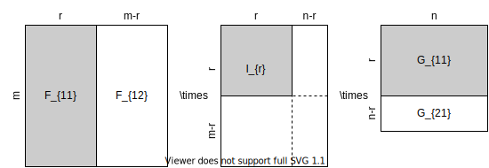

## Rank and dimension

 

* (4.1) **Rank as dimensionality of information.** The rank of $\mathbf A \in \mathbb R^{m \times n}$ is the maximal number of linearly independent columns of $\mathbf A.$ It follows that $0 \leq r \leq \min(m, n).$ Matrix rank has several applications, e.g. $\mathbf A^{-1}$ exists for a square matrix whenever it has maximal rank. In applied settings, rank is used in PCA, Factor Analysis, etc. because rank is used to determine how much nonredundant information is contained in $\mathbf A.$ 

 

* (4.2) **Computing the rank.** How to count the maximal number of linearly independent columns? (1) Row reduction (can be numerically unstable). (2) Best way is to use SVD. The rank of $\mathbf A$ is the number $r$ of nonzero singular values of $\mathbf A.$ This is how it's implemented in MATLAB and NumPy. The SVD is also used for rank estimation. Another way is to count the number of nonzero eigenvalues of $\mathbf A$ provided $\mathbf A$ has an eigendecomposition. Since this would imply that $\mathbf A$ is similar to its matrix of eigenvalues. This is in general not true. Instead, we can count the eigenvalues of $\mathbf A^\top \mathbf A$ or $\mathbf A\mathbf A^\top$ &mdash; whichever is smaller &mdash; since an eigendecomposition for both matrices always exist. In practice, counting the rank requires setting a threshold below which values which determine rank are treated as zero, e.g. singular values $\sigma_k$ in the SVD. 

 

* (4.3) **Rank can be difficult to calculate numerically.** For instance if we obtain $\sigma_k = 10^{-13}$ numerically, is it a real nonzero singular value, or is it zero? In practice, we set thresholds. The choice of threshold can be arbitrary or domain specific, and in general, introduces its own difficulties. Another issue is noise, adding $\epsilon\mathbf I$ makes $\mathbf A = [[1, 1], [1, 1]]$ rank two.

 

* (4.4) **Finding a basis for the column space.** We will be particularly interested in finding a subset of the columns of $\mathbf A$ that is a basis for $\mathsf{C}(\mathbf A).$ The problem in abstract terms is to find a linearly independent subset of a spanning set that spans the space. One can proceed iteratively. Let $\mathbf a_1, \ldots, \mathbf a_n$ be the columns of $\mathbf A$, take the largest $j$ such that $\sum_{j=1}^n c_j \mathbf a_j = \mathbf 0$ and $c_j \neq 0.$ We can remove this vector $\mathbf a_j$ such that the remaining columns still span $\mathsf{C}(\mathbf A).$ Repeat until we get $r$ columns that is linearly independent, i.e. $\sum_{j=1}^n c_j \mathbf a_j = \mathbf 0$ implies $c_j = 0$ for all $j.$ Further removing any vector fails to span the column space, or the column space is zero in the worst case, so we know this algorithm terminates.   
Another way to construct a basis for $\mathsf{C}(\mathbf A)$ is to perform Gaussian elimination along the columns of $\mathbf A$ as each step preserves the column space. The resulting pivot columns form a basis for $\mathsf{C}(\mathbf A)$ but is not a subset of the columns of $\mathbf A.$

 

* (4.5) **Basis and dimension.** Basis vectors are linearly independent vectors that span the vector space. We will be interested in finite-dimensional vector spaces, i.e. spaces that are spanned by finitely many vectors. By the above algorithm, we can always reduce the spanning set to a basis, so that a finite-dimensional vector space always has a (finite) basis. We know that a basis is not unique &mdash; in the previous bullet we constructed two bases for $\mathsf{C}(\mathbf A).$ However, once a basis $\mathbf v_1, \ldots, \mathbf v_n$ is fixed, every vector $\mathbf x$ has a unique representation $(x_1, \ldots, x_n)$ such that $\mathbf x = \sum_{i=1}^n x_i \mathbf v_i.$ We can think of this as a **parametrization** of the space by $n$ numbers. It is natural to ask whether there exists a more compressed parametrization, i.e. a basis of shorter length. It turns out that the length of any basis of a finite-dimensional vector space have the same length. Thus, we can think of this number as a property of the space which we define to be its **dimension**. This can be proved with the help of the ff. lemma since a basis is simultaneously spanning and linearly independent:

  > (Finite-dim.) The cardinality of any linearly independent set of vectors is bounded by the cardinality of any spanning set of the vector space.

   

  **Proof.**   The idea for the proof is that we can iteratively exchange vectors in a spanning set with vectors in linearly independent set while preserving the span. 
  Let $\mathbf u_1, \ldots, \mathbf u_{s}$ be a linearly independent list and $\mathbf v_1, \ldots, \mathbf v_{t}$ be a spanning set in $V.$ We iteratively update the spanning set keeping it at fixed length $t.$ Append $\mathbf u_1, \mathbf v_1, \ldots, \mathbf v_{t}.$ This list is linearly dependent since $\mathbf u_1 \in V.$ Possibly reindexing, let $\mathbf u_1$ depend on $\mathbf v_1$, then $\mathbf u_1, \mathbf v_2, \ldots, \mathbf v_{t}$ spans $V.$ Now append $\mathbf u_2, \mathbf u_1, \mathbf v_2, \ldots, \mathbf v_{t}.$ Note that $\mathbf u_2$ cannot depend solely on $\mathbf u_1$ by linear independence, so that $\mathbf u_2$ depends on $\mathbf v_2$ possibly reindexing. That is, we know $c_2 \neq 0$ in the ff. equation:
  $$
  \mathbf u_2 = c_1 \mathbf u_1 + \sum_{j=2}^t c_j \mathbf v_j \implies \mathbf v_2 = \frac{c_1}{c_2} \mathbf u_1 - \frac{1}{c_2} \mathbf u_2 + \sum_{j=3}^t \frac{c_j}{c_2} \mathbf v_j 
  $$
  so that $\mathbf u_2, \mathbf u_1, \mathbf v_3, \ldots, \mathbf v_{t}$ spans $V.$ That is, we have exchanged $\mathbf u_2$ with $\mathbf v_2$ in the spanning set. Repeat this until we get all $\mathbf u_j$'s on the left end of the list. This necessarily implies that $s \leq t$ since we cannot run out of $\mathbf v_i$ vectors in the spanning set due to linear independence of the $\mathbf u_j$'s. $\square$

 

* (4.6) **Obtaining a basis by counting.** This example shows how we can use the bound to reason about linearly independent lists/sets. A linearly independent set of length $r$ where $r$ is the dimension of the space is necessarily a basis. Otherwise, we can append the vector that is not spanned to get a linearly independent list of size $r+1.$

 

* (4.7) **Row rank = column rank.** 
  Consider a step in Gaussian elimination along the rows of $\mathbf A$ resulting in $\tilde \mathbf A.$ We know that $\mathsf{R}(\mathbf A) = \mathsf{R}(\tilde\mathbf A).$ So its clear that the row rank remains unchanged. 
  On the other hand, let's consider the independence of the columns after a step. We know there are $r$ basis vectors in the columns of $\mathbf A$ and the $n - r$ non-basis vectors are a linear combination of the $r$ basis vectors. 
  WLOG, suppose the first $r$ columns of $\mathbf A$ form the basis for $\mathsf{C}(\mathbf A).$ Then, for $j > r$, there exist a vector $\mathbf x$ such that $\mathbf A \mathbf x = \mathbf 0$ and $x_j = -1$ which encode the dependencies. Moreover, the only solution of the homogeneous system such that $x_j = 0$ for $j > r$ is $\mathbf x = \mathbf 0.$ Observe that $\mathbf A$ and $\tilde\mathbf A$ have the same null space as an inductive invariant, so that the index of the basis vectors in the columns of $\mathbf A$ are carried over to $\tilde \mathbf A.$ It follows that, the column rank of $\tilde \mathbf A$ is equal to the column rank of $\mathbf A.$ Thus, in every step of Gaussian elimination the column and row ranks are invariant. At the end of the algorithm, with $r$ pivots remaining, we can read off that $r$ maximally independent rows and $r$ maximally independent columns. It follows that the column and row ranks of $\mathbf A$ are equal.

 

* (4.8) **Multiplication with an invertible matrix preserves rank.** Suppose $\mathbf U$ is invertible, then $\mathbf U \mathbf A \mathbf x = \mathbf 0$ if and only if $\mathbf A \mathbf x = \mathbf 0$ so that $\mathbf U \mathbf A$ and $\mathbf A$ have the same null space. Thus, they have the same rank by the rank-nullity theorem. On the other hand, 
  $$
  \text{rank }(\mathbf A \mathbf U) = \text{rank } (\mathbf U^\top \mathbf A^\top) = \text{rank }\mathbf (\mathbf A^\top) = \text{rank }\mathbf (\mathbf A)
  $$ 
  since $\mathbf U^\top$ is invertible and row rank equals column rank. As a corollary, if two matrices $\mathbf A$ and $\mathbf B$ are similar, i.e. $\mathbf A = \mathbf U \mathbf B \mathbf U^{-1}$ for some invertible matrix $\mathbf U$, then they have the same rank. Another corollary is that the number of nonzero singular values of $\mathbf A$ is equal to its rank in the decomposition $\mathbf A = \mathbf U \mathbf \Sigma \mathbf V^\top$ since $\mathbf U$ and $\mathbf V^\top$ are both invertible.

   

  **Remark.** This also geometrically makes sense, i.e. automorphism on the input and output spaces. Applying $\mathbf U$ to a basis of $\mathsf C(\mathbf A)$ results in a basis of the same cardinality. So that $\mathsf C(\mathbf U \mathbf A)$ has the same dimension. On the other hand, transforming the input space by $\mathbf U,$ we still get $\mathbb R^n$ so that $\mathsf C(\mathbf A) = \mathsf C (\mathbf A \mathbf U).$ Then, we can prove equality of row and column rank by constructing a CR decomposition by means of left and right multiplying elementary matrices which do not change rank, and whose products have independent columns and rows, respectively.   

  

     
  <b>Figure.</b> Visualizing the CR decomposition.
  

 

* (4.9) **Generate rank 4 matrix 10x10 matrix randomly by multiplying two randomly generated matrices.** Solution is to multiply 10x4 and 4x10 matrices. Here we assume, reasonably so, that the randomly generated matrices have maximal rank. 

 

* (4.10) **Rank of $\mathbf A^\top \mathbf A$ and $\mathbf A \mathbf A^\top$.** These are all equal to the rank of $\mathbf A.$ 
The first equality can be proved using by showing the $\mathsf{N} (\mathbf A^\top \mathbf A) = \mathsf{N}( \mathbf A),$ and then invoke the rank-nullity theorem. We used this in the proof of SVD to show conclude that rank $\mathbf A$ is the number of nonzero singular values of $\mathbf A.$ The second equality follows by replacing $\mathbf A$ with $\mathbf A^\top$ and the fact that row rank equals column rank.  
We can also see this from the SVD which gives us $\mathbf A \mathbf A^\top = \mathbf U \mathbf \Sigma \mathbf \Sigma^\top \mathbf U^\top$ i.e. similar to $\Sigma \mathbf \Sigma^\top$ which has $r = \text{rank }\mathbf A$ diagonal entries. 
Thus, $\text{rank } \mathbf A \mathbf A^\top = \text{rank }\mathbf A = r.$ 

 

* (4.11) **Making a matrix full-rank by shifting:** $\tilde\mathbf A = \mathbf A + \lambda \mathbf I$ where we assume $\mathbf A$ is square. This is done for computational stability reasons. Typically the regularization constant $\lambda$ is less than the experimental noise. For instance, if $|\lambda| \gg \max |a_{ij}|,$ then $\tilde \mathbf A \approx \lambda \mathbf I$ and $\mathbf A$ becomes the noise. An exchange in the Q&A highlights another important issue. Hamzah asks:
  > So in a previous video in this section, you talked about how a 3 dimensional matrix spanning a 2 dimensional subspace [...] really is a rank 2 matrix, BUT if you introduce some noise, it can look like like a rank 3 matrix. [...] By adding the identity matrix, aren't you essentially deliberately adding noise to an existing dataset to artificially boost the rank? Am I correct in interpreting that you can possibly identify features in the boosted rank matrix that may not actually exist in the true dataset, and maybe come up with some weird conclusions? If that is the case wouldn't it be very dangerous to increase the rank by adding the identity matrix? Would appreciate some clarification. Thank you!

  To which Mike answers:

  > Excellent observation, and good question. Indeed, there is a huge and decades-old literature about exactly this issue -- how much "noise" to add to data? In statistics and machine learning, adding noise is usually done as part of regularization.   
  The easy answer is that you want to shift the matrix by as little as possible to avoid changing the data, while still adding enough to make the solutions work. I don't go into a lot of detail about that in this course, but often, somewhere around 1% of the average eigenvalues of the matrix provides a good balance.   
  Note that this is done for numerical stability reasons, not for theoretical reasons. So the balance is: Do I want to keep my data perfect and get no results, or am I willing to lose a bit of data precision in order to get good results?

 

* (4.12) **Is this vector in the span of this set?** Let $\mathbf x \in \mathbb R^m$ be a test vector. Is $\mathbf x$ in the span of $\mathbf a_1, \ldots, \mathbf a_n \in \mathbb R^m.$ Let $\mathbf A = [\mathbf a_1, \ldots, \mathbf a_n]$ with rank $r.$ The solution is to check whether the rank of $[\mathbf A | \mathbf x]$ is equal to the $r$ (in span) or $r+1$ (not in span). 